# Technical Specifications

## 1. INTRODUCTION

### EXECUTIVE SUMMARY

| Aspect | Description |
|--------|-------------|
| Project Overview | A simple Node.js HTTP server application that exposes a single REST endpoint `/hello` which returns "Hello world" to clients |
| Business Problem | Provides a minimal, functional example of a Node.js web service that can serve as a learning tool or starter template |
| Key Stakeholders | Developers learning Node.js, technical trainers, software engineers requiring a baseline implementation |
| Value Proposition | Demonstrates fundamental Node.js web service concepts with minimal complexity, enabling rapid learning and implementation |

### SYSTEM OVERVIEW

#### Project Context

| Context Element | Description |
|-----------------|-------------|
| Business Context | Educational tool for Node.js server development fundamentals |
| Current Limitations | N/A - New implementation |
| Enterprise Integration | Standalone application with no external dependencies beyond Node.js runtime |

#### High-Level Description

The system is a lightweight Node.js HTTP server application that:
- Listens for incoming HTTP requests on a configurable port
- Routes requests to the `/hello` endpoint
- Returns a "Hello world" text response with appropriate HTTP headers
- Handles basic error conditions

#### Success Criteria

| Criteria Type | Description |
|---------------|-------------|
| Measurable Objectives | - Server successfully starts and listens on configured port - `/hello` endpoint returns "Hello world" with 200 status code - Proper error handling for invalid routes |
| Critical Success Factors | - Minimal dependencies to ensure simplicity - Clear documentation for setup and usage - Reliable operation under expected load |
| Key Performance Indicators | - Response time under 50ms for the endpoint - Successful handling of concurrent requests |

### SCOPE

#### In-Scope

**Core Features and Functionalities:**
- HTTP server implementation using Node.js
- Single `/hello` endpoint returning "Hello world" text response
- Basic error handling for invalid routes
- Server configuration (port, host)
- Documentation for setup and usage

**Implementation Boundaries:**
- Single-server deployment
- Local development environment support
- Standard HTTP protocol support
- Plain text response format

#### Out-of-Scope

- Authentication and authorization mechanisms
- Database integration
- Multiple endpoints beyond `/hello`
- Advanced error handling and logging
- Production deployment configurations
- Performance optimization
- Containerization
- Automated testing framework
- CI/CD pipeline integration
- Monitoring and alerting

## 2. PRODUCT REQUIREMENTS

### 2.1 FEATURE CATALOG

#### 2.1.1 HTTP Server Feature

| Metadata | Value |
|----------|-------|
| Unique ID | F-001 |
| Feature Name | HTTP Server |
| Feature Category | Core Infrastructure |
| Priority Level | Critical |
| Status | Approved |

**Description:**

| Aspect | Details |
|--------|---------|
| Overview | A Node.js HTTP server that listens for incoming requests on a configurable port |
| Business Value | Provides the foundation for serving HTTP requests in a lightweight, efficient manner |
| User Benefits | Enables developers to understand basic Node.js server implementation patterns |
| Technical Context | Uses Node.js built-in HTTP module to create a server instance that binds to a network port |

**Dependencies:**

| Type | Details |
|------|---------|
| Prerequisite Features | None |
| System Dependencies | Node.js runtime environment |
| External Dependencies | None |
| Integration Requirements | None |

#### 2.1.2 Hello Endpoint Feature

| Metadata | Value |
|----------|-------|
| Unique ID | F-002 |
| Feature Name | Hello Endpoint |
| Feature Category | API Endpoint |
| Priority Level | Critical |
| Status | Approved |

**Description:**

| Aspect | Details |
|--------|---------|
| Overview | A REST endpoint at path `/hello` that returns "Hello world" text response |
| Business Value | Demonstrates basic HTTP request handling and response generation |
| User Benefits | Provides a simple, working example of a REST endpoint implementation |
| Technical Context | Implemented as a route handler within the HTTP server that processes GET requests |

**Dependencies:**

| Type | Details |
|------|---------|
| Prerequisite Features | F-001 (HTTP Server) |
| System Dependencies | None |
| External Dependencies | None |
| Integration Requirements | None |

#### 2.1.3 Error Handling Feature

| Metadata | Value |
|----------|-------|
| Unique ID | F-003 |
| Feature Name | Error Handling |
| Feature Category | System Functionality |
| Priority Level | High |
| Status | Approved |

**Description:**

| Aspect | Details |
|--------|---------|
| Overview | Basic error handling for invalid routes and server errors |
| Business Value | Ensures graceful handling of unexpected conditions |
| User Benefits | Provides clear feedback when errors occur |
| Technical Context | Implemented through HTTP status codes and appropriate error messages |

**Dependencies:**

| Type | Details |
|------|---------|
| Prerequisite Features | F-001 (HTTP Server) |
| System Dependencies | None |
| External Dependencies | None |
| Integration Requirements | None |

### 2.2 FUNCTIONAL REQUIREMENTS TABLE

#### 2.2.1 HTTP Server Requirements

| Requirement Details | Value |
|---------------------|-------|
| Requirement ID | F-001-RQ-001 |
| Description | The system shall implement an HTTP server using Node.js |
| Acceptance Criteria | Server successfully starts and listens for incoming connections |
| Priority | Must-Have |
| Complexity | Low |

**Technical Specifications:**

| Aspect | Details |
|--------|---------|
| Input Parameters | Port number (configurable, default: 3000) |
| Output/Response | Server instance listening on specified port |
| Performance Criteria | Server startup time < 1 second |
| Data Requirements | None |

**Validation Rules:**

| Rule Type | Details |
|-----------|---------|
| Business Rules | None |
| Data Validation | Port number must be a valid integer between 1024-65535 |
| Security Requirements | None |
| Compliance Requirements | None |

| Requirement Details | Value |
|---------------------|-------|
| Requirement ID | F-001-RQ-002 |
| Description | The server shall log startup information to the console |
| Acceptance Criteria | Console displays message indicating server is running and port number |
| Priority | Should-Have |
| Complexity | Low |

**Technical Specifications:**

| Aspect | Details |
|--------|---------|
| Input Parameters | None |
| Output/Response | Console log message |
| Performance Criteria | None |
| Data Requirements | None |

**Validation Rules:**

| Rule Type | Details |
|-----------|---------|
| Business Rules | None |
| Data Validation | None |
| Security Requirements | None |
| Compliance Requirements | None |

#### 2.2.2 Hello Endpoint Requirements

| Requirement Details | Value |
|---------------------|-------|
| Requirement ID | F-002-RQ-001 |
| Description | The system shall implement a `/hello` endpoint that returns "Hello world" |
| Acceptance Criteria | GET request to `/hello` returns "Hello world" text with 200 status code |
| Priority | Must-Have |
| Complexity | Low |

**Technical Specifications:**

| Aspect | Details |
|--------|---------|
| Input Parameters | HTTP GET request to `/hello` path |
| Output/Response | Text response "Hello world" with Content-Type: text/plain |
| Performance Criteria | Response time < 50ms |
| Data Requirements | None |

**Validation Rules:**

| Rule Type | Details |
|-----------|---------|
| Business Rules | None |
| Data Validation | None |
| Security Requirements | None |
| Compliance Requirements | None |

#### 2.2.3 Error Handling Requirements

| Requirement Details | Value |
|---------------------|-------|
| Requirement ID | F-003-RQ-001 |
| Description | The system shall return a 404 status code for requests to undefined routes |
| Acceptance Criteria | Requests to any path other than `/hello` return 404 status code |
| Priority | Must-Have |
| Complexity | Low |

**Technical Specifications:**

| Aspect | Details |
|--------|---------|
| Input Parameters | HTTP request to any undefined path |
| Output/Response | 404 status code with appropriate error message |
| Performance Criteria | Response time < 50ms |
| Data Requirements | None |

**Validation Rules:**

| Rule Type | Details |
|-----------|---------|
| Business Rules | None |
| Data Validation | None |
| Security Requirements | None |
| Compliance Requirements | None |

### 2.3 FEATURE RELATIONSHIPS

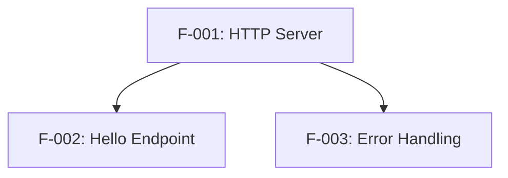
```mermaid
graph TD
    F001[F-001: HTTP Server] --> F002[F-002: Hello Endpoint]
    F001 --> F003[F-003: Error Handling]
```

**Integration Points:**
- The HTTP Server (F-001) provides the foundation for all other features
- The Hello Endpoint (F-002) is implemented as a route handler within the HTTP Server
- Error Handling (F-003) is integrated into the HTTP Server's request processing flow

### 2.4 IMPLEMENTATION CONSIDERATIONS

#### 2.4.1 HTTP Server Implementation

| Consideration | Details |
|---------------|---------|
| Technical Constraints | Use only Node.js built-in modules (no external dependencies) |
| Performance Requirements | Support multiple concurrent connections |
| Scalability Considerations | None for this simple implementation |
| Security Implications | None for this basic example |
| Maintenance Requirements | Minimal - designed as educational example |

#### 2.4.2 Hello Endpoint Implementation

| Consideration | Details |
|---------------|---------|
| Technical Constraints | Implement as simple route handler |
| Performance Requirements | Response time < 50ms |
| Scalability Considerations | None for this simple implementation |
| Security Implications | None for this basic example |
| Maintenance Requirements | None |

#### 2.4.3 Error Handling Implementation

| Consideration | Details |
|---------------|---------|
| Technical Constraints | Implement using standard HTTP status codes |
| Performance Requirements | Error responses should be as fast as successful responses |
| Scalability Considerations | None for this simple implementation |
| Security Implications | Avoid exposing system details in error messages |
| Maintenance Requirements | None |

## 3. TECHNOLOGY STACK

### 3.1 PROGRAMMING LANGUAGES

| Language | Version | Component | Justification |
|----------|---------|-----------|---------------|
| JavaScript | ES6+ | Server | JavaScript is the native language for Node.js applications, providing a consistent language environment for server-side development |
| Node.js | 18.x LTS | Runtime Environment | Long-term support version offering stability, security updates, and compatibility with modern JavaScript features |

### 3.2 FRAMEWORKS & LIBRARIES

| Framework/Library | Version | Purpose | Justification |
|-------------------|---------|---------|---------------|
| Node.js HTTP Module | Built-in | Core server functionality | Native HTTP module eliminates external dependencies, reducing complexity and potential security vulnerabilities |
| None (No external NPM packages) | N/A | N/A | External dependencies are deliberately avoided to maintain simplicity and minimize maintenance requirements |

### 3.3 DEVELOPMENT & DEPLOYMENT

| Tool/Technology | Version | Purpose | Justification |
|-----------------|---------|---------|---------------|
| npm | 9.x+ | Package management | Standard package manager for Node.js ecosystem, used for script execution and potential future dependency management |
| nodemon | 2.x (dev only) | Development server | Optional development tool that provides automatic server restarts during development |
| Git | 2.x+ | Version control | Industry standard for source code management |

### 3.4 ARCHITECTURE DIAGRAM

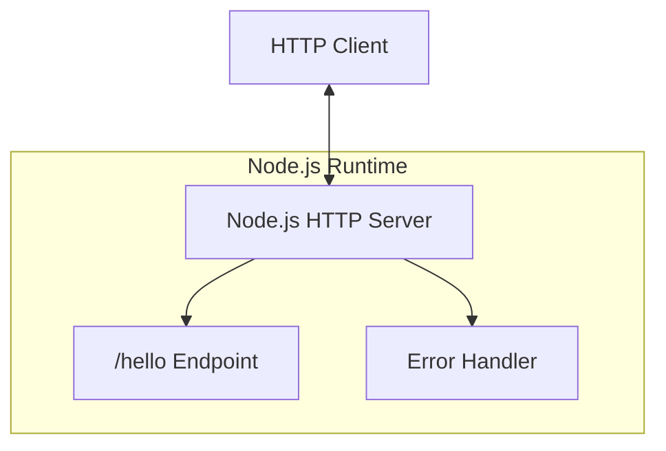
```mermaid
flowchart TD
    Client[HTTP Client] <--> NodeServer[Node.js HTTP Server]
    NodeServer --> HelloEndpoint["/hello" Endpoint]
    NodeServer --> ErrorHandler[Error Handler]
    
    subgraph "Node.js Runtime"
        NodeServer
        HelloEndpoint
        ErrorHandler
    end
```

### 3.5 TECHNOLOGY CONSTRAINTS & CONSIDERATIONS

| Constraint | Impact | Mitigation |
|------------|--------|------------|
| No external dependencies | Limits available functionality | Use Node.js built-in modules which are sufficient for this simple application |
| Single endpoint requirement | Simplified routing logic | Implement basic path matching rather than using a router library |
| Educational focus | Prioritizes readability over optimization | Maintain clear code structure with appropriate comments |

## 4. PROCESS FLOWCHART

### 4.1 SYSTEM WORKFLOWS

#### 4.1.1 Core Business Processes

##### HTTP Request Processing Workflow

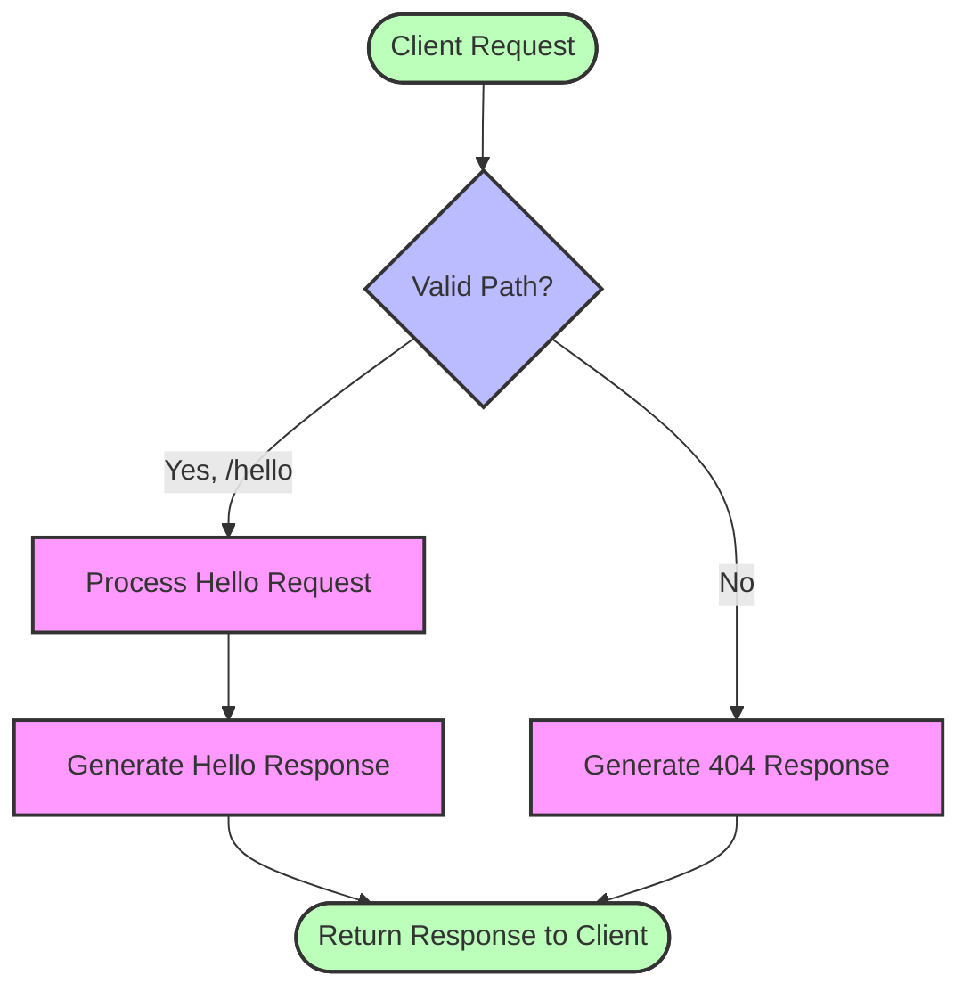
```mermaid
flowchart TD
    Start([Client Request]) --> A{Valid Path?}
    A -->|Yes, /hello| B[Process Hello Request]
    A -->|No| C[Generate 404 Response]
    B --> D[Generate Hello Response]
    D --> End([Return Response to Client])
    C --> End
    
    classDef process fill:#f9f,stroke:#333,stroke-width:2px;
    classDef decision fill:#bbf,stroke:#333,stroke-width:2px;
    classDef endpoint fill:#bfb,stroke:#333,stroke-width:2px;
    
    class Start,End endpoint;
    class A decision;
    class B,C,D process;
```

##### End-to-End User Journey

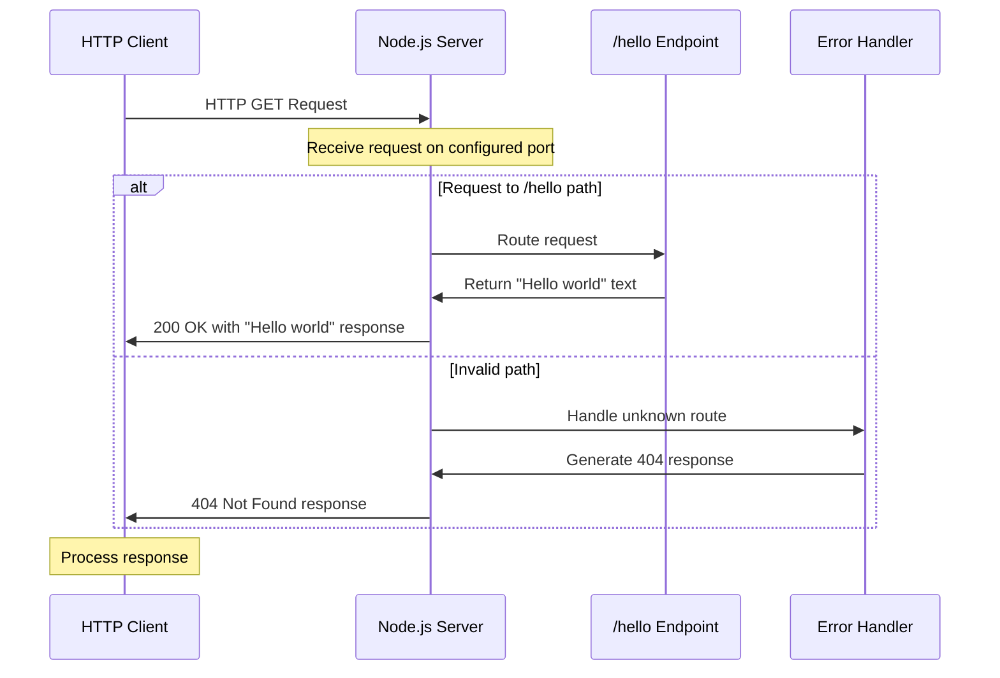
```mermaid
sequenceDiagram
    participant Client as HTTP Client
    participant Server as Node.js Server
    participant HelloEndpoint as /hello Endpoint
    participant ErrorHandler as Error Handler
    
    Client->>Server: HTTP GET Request
    Note over Server: Receive request on configured port
    
    alt Request to /hello path
        Server->>HelloEndpoint: Route request
        HelloEndpoint->>Server: Return "Hello world" text
        Server->>Client: 200 OK with "Hello world" response
    else Invalid path
        Server->>ErrorHandler: Handle unknown route
        ErrorHandler->>Server: Generate 404 response
        Server->>Client: 404 Not Found response
    end
    
    Note over Client: Process response
```

#### 4.1.2 Integration Workflows

##### API Request Flow

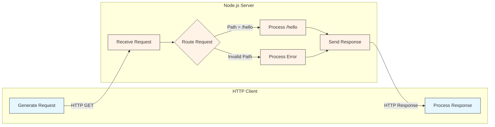
```mermaid
flowchart LR
    subgraph Client["HTTP Client"]
        ClientReq[Generate Request]
        ClientProc[Process Response]
    end
    
    subgraph Server["Node.js Server"]
        ServerRec[Receive Request]
        ServerRoute{Route Request}
        HelloProc[Process /hello]
        ErrorProc[Process Error]
        ServerResp[Send Response]
    end
    
    ClientReq -->|HTTP GET| ServerRec
    ServerRec --> ServerRoute
    ServerRoute -->|Path = /hello| HelloProc
    ServerRoute -->|Invalid Path| ErrorProc
    HelloProc --> ServerResp
    ErrorProc --> ServerResp
    ServerResp -->|HTTP Response| ClientProc
    
    classDef client fill:#e6f7ff,stroke:#333,stroke-width:1px;
    classDef server fill:#fff2e6,stroke:#333,stroke-width:1px;
    
    class ClientReq,ClientProc client;
    class ServerRec,ServerRoute,HelloProc,ErrorProc,ServerResp server;
```

### 4.2 FLOWCHART REQUIREMENTS

#### 4.2.1 Detailed Request Processing Workflow

```mermaid
flowchart TD
    A([Start: Incoming HTTP Request]) --> B[Parse HTTP Request]
    B --> C{Valid HTTP Method?}
    C -->|Yes| D{Check Request Path}
    C -->|No| E[Generate 405 Method Not Allowed]
    
    D -->|Path = /hello| F[Process Hello Request]
    D -->|Any Other Path| G[Generate 404 Not Found]
    
    F --> H[Set Content-Type: text/plain]
    H --> I[Set Status Code: 200 OK]
    I --> J["Set Response Body: 'Hello world'"]
    
    G --> K[Set Content-Type: text/plain]
    K --> L[Set Status Code: 404 Not Found]
    L --> M["Set Response Body: 'Not Found'"]
    
    E --> N[Set Content-Type: text/plain]
    N --> O[Set Status Code: 405 Method Not Allowed]
    O --> P["Set Response Body: 'Method Not Allowed'"]
    
    J --> Q[Send Response to Client]
    M --> Q
    P --> Q
    
    Q --> R([End: Request Processed])
    
    classDef start fill:#bfb,stroke:#333,stroke-width:2px
    classDef process fill:#f9f,stroke:#333,stroke-width:1px
    classDef decision fill:#bbf,stroke:#333,stroke-width:1px
    classDef end fill:#bfb,stroke:#333,stroke-width:2px
    
    class A,R start
    class B,E,F,G,H,I,J,K,L,M,N,O,P,Q process
    class C,D decision
```

#### 4.2.2 Validation Rules

| Process Step | Validation Rules | Error Response |
|--------------|------------------|----------------|
| Parse HTTP Request | Valid HTTP format | 400 Bad Request |
| Check HTTP Method | Must be GET for /hello endpoint | 405 Method Not Allowed |
| Check Request Path | Must match defined routes (/hello) | 404 Not Found |
| Process Response | Response must include proper headers | 500 Internal Server Error |

### 4.3 TECHNICAL IMPLEMENTATION

#### 4.3.1 State Management

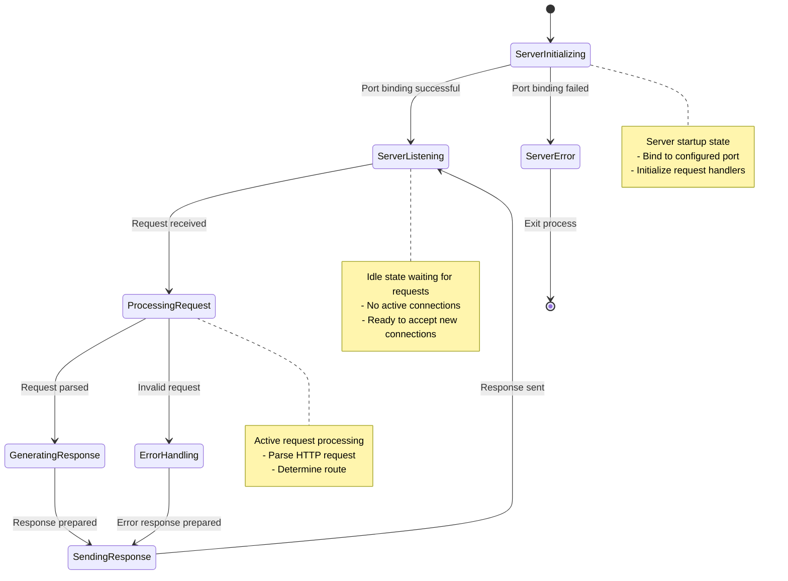
```mermaid
stateDiagram-v2
    [*] --> ServerInitializing
    ServerInitializing --> ServerListening: Port binding successful
    ServerInitializing --> ServerError: Port binding failed
    
    ServerListening --> ProcessingRequest: Request received
    ProcessingRequest --> GeneratingResponse: Request parsed
    GeneratingResponse --> SendingResponse: Response prepared
    SendingResponse --> ServerListening: Response sent
    
    ProcessingRequest --> ErrorHandling: Invalid request
    ErrorHandling --> SendingResponse: Error response prepared
    
    ServerError --> [*]: Exit process
    
    note right of ServerInitializing
        Server startup state
        - Bind to configured port
        - Initialize request handlers
    end note
    
    note right of ServerListening
        Idle state waiting for requests
        - No active connections
        - Ready to accept new connections
    end note
    
    note right of ProcessingRequest
        Active request processing
        - Parse HTTP request
        - Determine route
    end note
```

#### 4.3.2 Error Handling

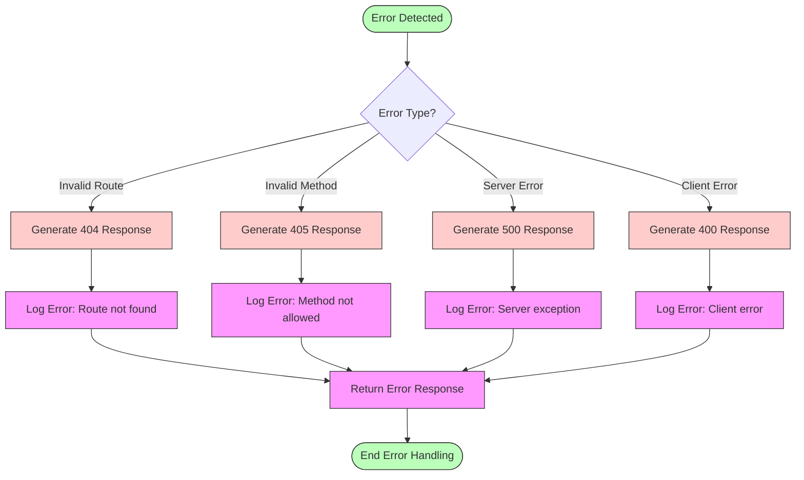
```mermaid
flowchart TD
    A([Error Detected]) --> B{Error Type?}
    
    B -->|Invalid Route| C[Generate 404 Response]
    B -->|Invalid Method| D[Generate 405 Response]
    B -->|Server Error| E[Generate 500 Response]
    B -->|Client Error| F[Generate 400 Response]
    
    C --> G[Log Error: Route not found]
    D --> H[Log Error: Method not allowed]
    E --> I[Log Error: Server exception]
    F --> J[Log Error: Client error]
    
    G --> K[Return Error Response]
    H --> K
    I --> K
    J --> K
    
    K --> L([End Error Handling])
    
    classDef error fill:#ffcccc,stroke:#333,stroke-width:1px;
    classDef process fill:#f9f,stroke:#333,stroke-width:1px;
    classDef endpoint fill:#bfb,stroke:#333,stroke-width:1px;
    
    class A,L endpoint;
    class B decision;
    class C,D,E,F,G,H,I,J,K process;
    class C,D,E,F error;
```

### 4.4 REQUIRED DIAGRAMS

#### 4.4.1 High-Level System Workflow

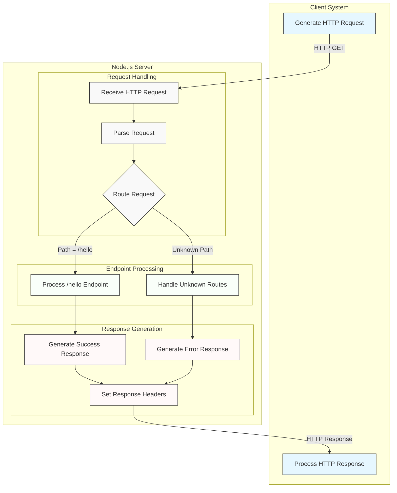
```mermaid
flowchart TD
    subgraph Client["Client System"]
        A[Generate HTTP Request]
        Z[Process HTTP Response]
    end
    
    subgraph Server["Node.js Server"]
        subgraph RequestHandling["Request Handling"]
            B[Receive HTTP Request]
            C[Parse Request]
            D{Route Request}
        end
        
        subgraph Endpoints["Endpoint Processing"]
            E[Process /hello Endpoint]
            F[Handle Unknown Routes]
        end
        
        subgraph ResponseGeneration["Response Generation"]
            G[Generate Success Response]
            H[Generate Error Response]
            I[Set Response Headers]
        end
    end
    
    A -->|HTTP GET| B
    B --> C
    C --> D
    D -->|Path = /hello| E
    D -->|Unknown Path| F
    E --> G
    F --> H
    G --> I
    H --> I
    I -->|HTTP Response| Z
    
    classDef client fill:#e6f7ff,stroke:#333,stroke-width:1px;
    classDef server fill:#fff2e6,stroke:#333,stroke-width:1px;
    classDef request fill:#f9f9f9,stroke:#333,stroke-width:1px;
    classDef endpoint fill:#f9fff9,stroke:#333,stroke-width:1px;
    classDef response fill:#fff9f9,stroke:#333,stroke-width:1px;
    
    class A,Z client;
    class B,C,D request;
    class E,F endpoint;
    class G,H,I response;
```

#### 4.4.2 Detailed Process Flow for Hello Endpoint

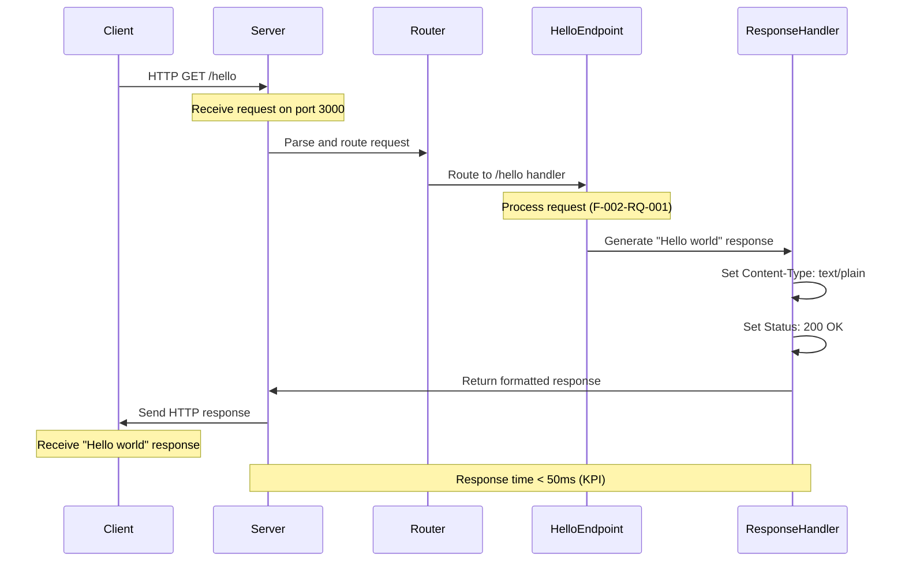
```mermaid
sequenceDiagram
    participant Client
    participant Server
    participant Router
    participant HelloEndpoint
    participant ResponseHandler
    
    Client->>Server: HTTP GET /hello
    Note over Server: Receive request on port 3000
    Server->>Router: Parse and route request
    
    Router->>HelloEndpoint: Route to /hello handler
    Note over HelloEndpoint: Process request (F-002-RQ-001)
    HelloEndpoint->>ResponseHandler: Generate "Hello world" response
    
    ResponseHandler->>ResponseHandler: Set Content-Type: text/plain
    ResponseHandler->>ResponseHandler: Set Status: 200 OK
    ResponseHandler->>Server: Return formatted response
    
    Server->>Client: Send HTTP response
    Note over Client: Receive "Hello world" response
    
    Note over Server,ResponseHandler: Response time < 50ms (KPI)
```

#### 4.4.3 Error Handling Flowchart

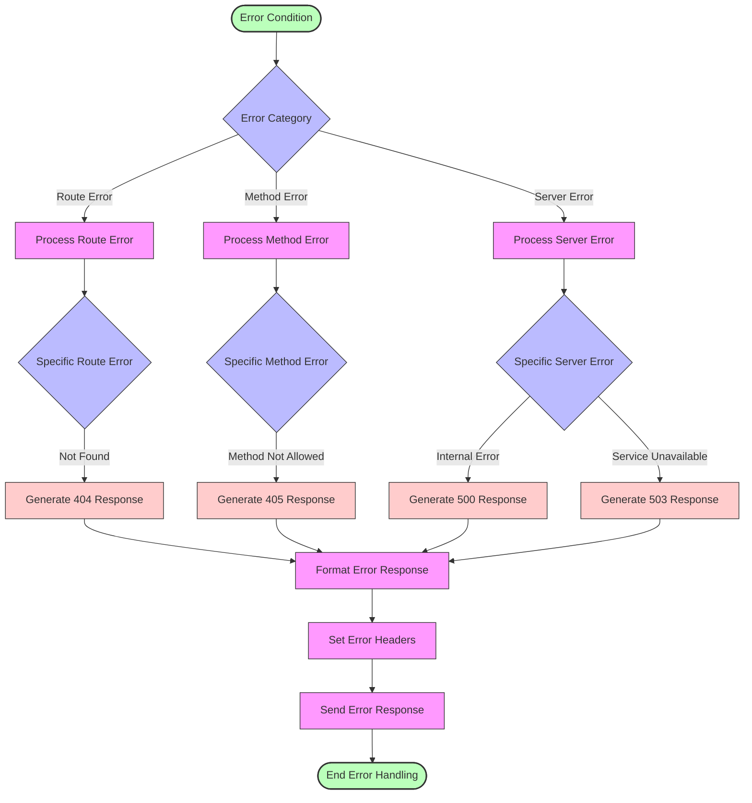
```mermaid
flowchart TD
    A([Error Condition]) --> B{Error Category}
    
    B -->|Route Error| C[Process Route Error]
    B -->|Method Error| D[Process Method Error]
    B -->|Server Error| E[Process Server Error]
    
    C --> F{Specific Route Error}
    F -->|Not Found| G[Generate 404 Response]
    
    D --> H{Specific Method Error}
    H -->|Method Not Allowed| I[Generate 405 Response]
    
    E --> J{Specific Server Error}
    J -->|Internal Error| K[Generate 500 Response]
    J -->|Service Unavailable| L[Generate 503 Response]
    
    G --> M[Format Error Response]
    I --> M
    K --> M
    L --> M
    
    M --> N[Set Error Headers]
    N --> O[Send Error Response]
    O --> P([End Error Handling])
    
    classDef start fill:#bfb,stroke:#333,stroke-width:2px;
    classDef process fill:#f9f,stroke:#333,stroke-width:1px;
    classDef decision fill:#bbf,stroke:#333,stroke-width:1px;
    classDef error fill:#ffcccc,stroke:#333,stroke-width:1px;
    
    class A,P start;
    class B,F,H,J decision;
    class C,D,E,M,N,O process;
    class G,I,K,L error;
```

#### 4.4.4 Integration Sequence Diagram

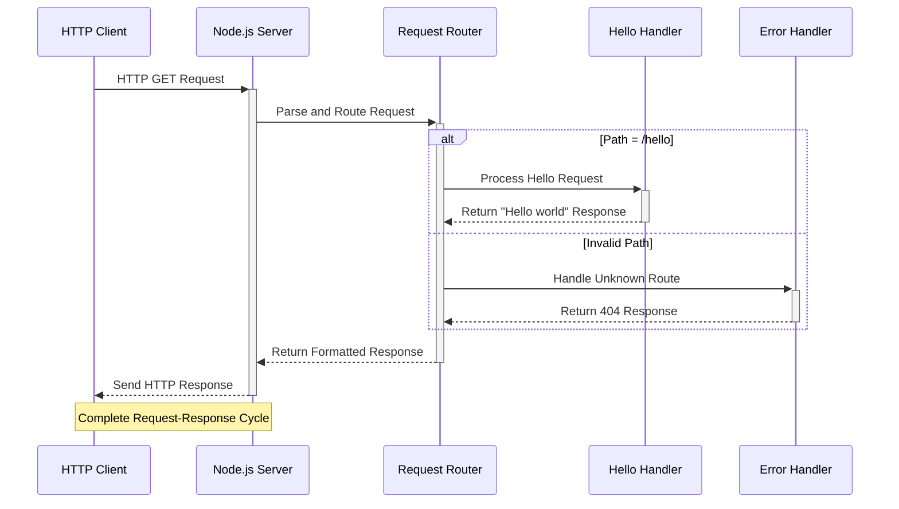
```mermaid
sequenceDiagram
    participant Client as HTTP Client
    participant Server as Node.js Server
    participant Router as Request Router
    participant HelloHandler as Hello Handler
    participant ErrorHandler as Error Handler
    
    Client->>+Server: HTTP GET Request
    Server->>+Router: Parse and Route Request
    
    alt Path = /hello
        Router->>+HelloHandler: Process Hello Request
        HelloHandler-->>-Router: Return "Hello world" Response
    else Invalid Path
        Router->>+ErrorHandler: Handle Unknown Route
        ErrorHandler-->>-Router: Return 404 Response
    end
    
    Router-->>-Server: Return Formatted Response
    Server-->>-Client: Send HTTP Response
    
    Note over Client,Server: Complete Request-Response Cycle
```

#### 4.4.5 State Transition Diagram

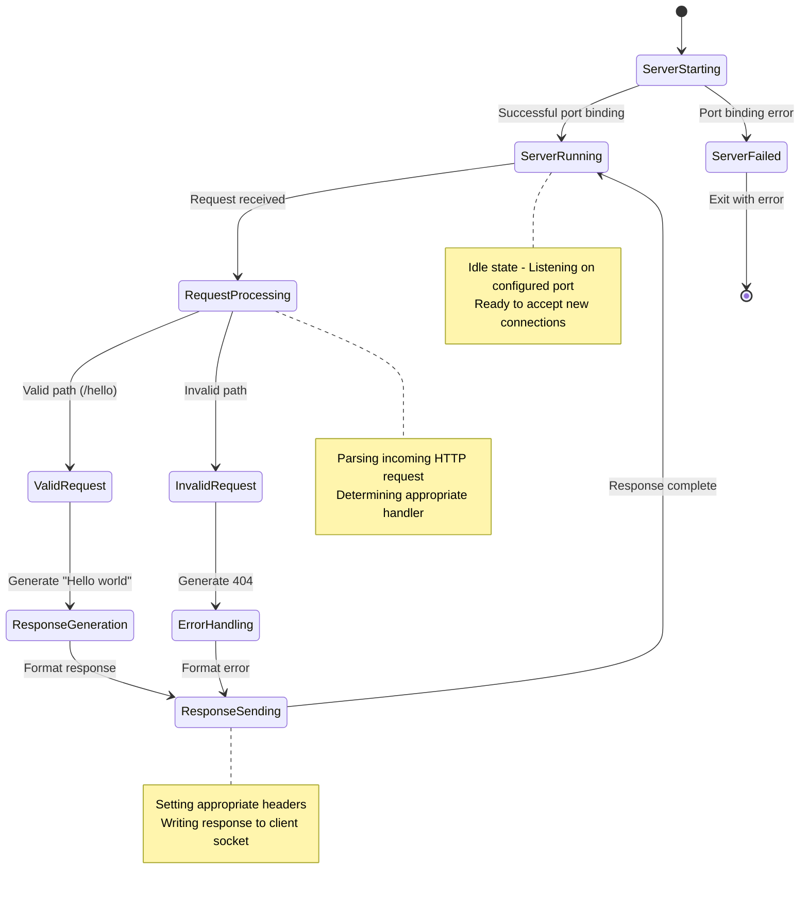
```mermaid
stateDiagram-v2
    [*] --> ServerStarting
    
    ServerStarting --> ServerRunning: Successful port binding
    ServerStarting --> ServerFailed: Port binding error
    
    ServerRunning --> RequestProcessing: Request received
    RequestProcessing --> ValidRequest: Valid path (/hello)
    RequestProcessing --> InvalidRequest: Invalid path
    
    ValidRequest --> ResponseGeneration: Generate "Hello world"
    InvalidRequest --> ErrorHandling: Generate 404
    
    ResponseGeneration --> ResponseSending: Format response
    ErrorHandling --> ResponseSending: Format error
    
    ResponseSending --> ServerRunning: Response complete
    
    ServerFailed --> [*]: Exit with error
    
    note right of ServerRunning
        Idle state - Listening on configured port
        Ready to accept new connections
    end note
    
    note right of RequestProcessing
        Parsing incoming HTTP request
        Determining appropriate handler
    end note
    
    note right of ResponseSending
        Setting appropriate headers
        Writing response to client socket
    end note
```

## 5. SYSTEM ARCHITECTURE

### 5.1 HIGH-LEVEL ARCHITECTURE

#### 5.1.1 System Overview

The Node.js Hello World application follows a simple monolithic architecture pattern, appropriate for its minimal requirements. The system employs a single-tier architecture where all components run within a single Node.js process.

- **Architectural Style**: Monolithic, single-process HTTP server using Node.js built-in modules
- **Key Architectural Principles**:
  - Simplicity: Minimizing dependencies and complexity
  - Modularity: Separating concerns between request handling, routing, and response generation
  - Statelessness: No session state maintained between requests
- **System Boundaries**: The application operates as a standalone HTTP server with no external dependencies beyond the Node.js runtime
- **Major Interfaces**: Single REST endpoint `/hello` exposed via HTTP protocol

The architecture deliberately avoids unnecessary complexity, focusing on demonstrating core Node.js HTTP server capabilities without introducing external frameworks or libraries.

#### 5.1.2 Core Components Table

| Component Name | Primary Responsibility | Key Dependencies | Critical Considerations |
|----------------|------------------------|------------------|-------------------------|
| HTTP Server | Listen for incoming connections and manage request/response lifecycle | Node.js http module | Port configuration, connection handling |
| Request Router | Parse incoming requests and direct to appropriate handler | HTTP Server | Path matching logic, HTTP method validation |
| Hello Endpoint Handler | Process requests to `/hello` and generate responses | Request Router | Response format, status code |
| Error Handler | Process invalid routes and generate error responses | Request Router | Appropriate status codes, error messages |

#### 5.1.3 Data Flow Description

The data flow in this system is straightforward and unidirectional:

1. The HTTP Server receives incoming HTTP requests on the configured port
2. The Request Router parses the request URL and HTTP method
3. Based on the URL path, the router directs the request to either:
   - The Hello Endpoint Handler for `/hello` requests
   - The Error Handler for all other paths
4. The appropriate handler generates a response (success or error)
5. The HTTP Server sends the response back to the client

There are no data persistence requirements, caches, or complex transformations in this simple application. All processing occurs in-memory within the Node.js process.

#### 5.1.4 External Integration Points

| System Name | Integration Type | Data Exchange Pattern | Protocol/Format |
|-------------|------------------|------------------------|-----------------|
| HTTP Clients | Synchronous API | Request-Response | HTTP/Plain Text |

### 5.2 COMPONENT DETAILS

#### 5.2.1 HTTP Server Component

- **Purpose**: Establish an HTTP server that listens for incoming connections on a configured port
- **Responsibilities**:
  - Bind to network interface and port
  - Accept incoming TCP connections
  - Parse HTTP requests
  - Route requests to appropriate handlers
  - Send responses back to clients
- **Technologies**: Node.js built-in `http` module
- **Key Interfaces**:
  - `createServer()`: Creates HTTP server instance
  - `listen()`: Binds server to specified port
- **Scaling Considerations**: Single-process design suitable for educational purposes; no clustering or load balancing required

#### 5.2.2 Request Router Component

- **Purpose**: Determine the appropriate handler for each incoming request
- **Responsibilities**:
  - Parse request URL path
  - Validate HTTP method
  - Route to correct handler based on path
  - Invoke error handler for invalid routes
- **Technologies**: Node.js URL parsing capabilities
- **Key Interfaces**:
  - Request handler function that receives (req, res) objects
- **Scaling Considerations**: Simple path matching sufficient for single endpoint

#### 5.2.3 Hello Endpoint Handler Component

- **Purpose**: Process requests to the `/hello` endpoint
- **Responsibilities**:
  - Validate the request is a GET method
  - Generate "Hello world" text response
  - Set appropriate HTTP headers
  - Send response with 200 status code
- **Technologies**: Node.js HTTP response methods
- **Key Interfaces**:
  - Handler function that receives (req, res) objects
- **Scaling Considerations**: Stateless design requires no special scaling considerations

#### 5.2.4 Error Handler Component

- **Purpose**: Process requests to invalid routes
- **Responsibilities**:
  - Generate appropriate error responses
  - Set correct HTTP status codes
  - Provide meaningful error messages
- **Technologies**: Node.js HTTP response methods
- **Key Interfaces**:
  - Handler function that receives (req, res) objects
- **Scaling Considerations**: Stateless design requires no special scaling considerations

#### 5.2.5 Component Interaction Diagram

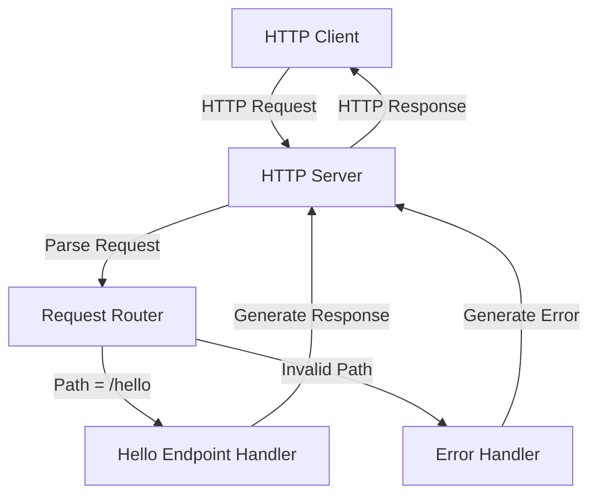
```mermaid
flowchart TD
    Client[HTTP Client] -->|HTTP Request| Server[HTTP Server]
    Server -->|Parse Request| Router[Request Router]
    Router -->|Path = /hello| HelloHandler[Hello Endpoint Handler]
    Router -->|Invalid Path| ErrorHandler[Error Handler]
    HelloHandler -->|Generate Response| Server
    ErrorHandler -->|Generate Error| Server
    Server -->|HTTP Response| Client
```

#### 5.2.6 Sequence Diagram for Hello Endpoint Request

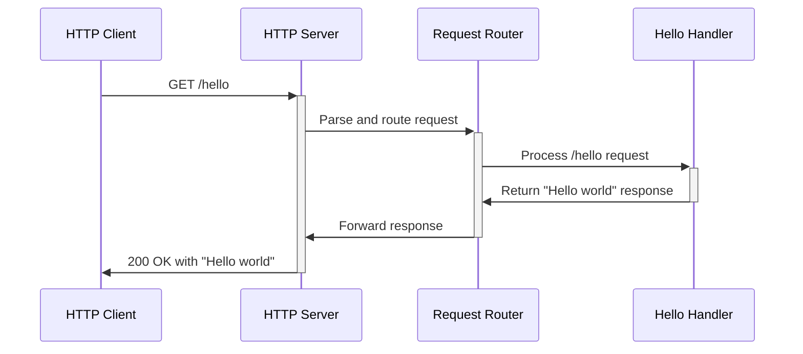
```mermaid
sequenceDiagram
    participant Client as HTTP Client
    participant Server as HTTP Server
    participant Router as Request Router
    participant Handler as Hello Handler
    
    Client->>+Server: GET /hello
    Server->>+Router: Parse and route request
    Router->>+Handler: Process /hello request
    Handler->>-Router: Return "Hello world" response
    Router->>-Server: Forward response
    Server->>-Client: 200 OK with "Hello world"
```

#### 5.2.7 Sequence Diagram for Invalid Route Request

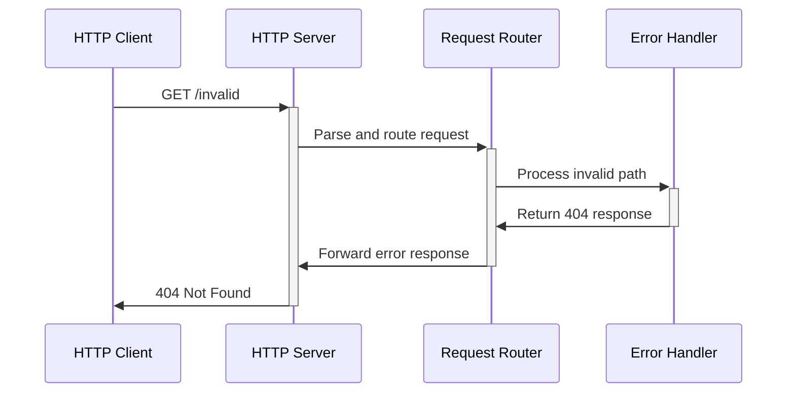
```mermaid
sequenceDiagram
    participant Client as HTTP Client
    participant Server as HTTP Server
    participant Router as Request Router
    participant ErrHandler as Error Handler
    
    Client->>+Server: GET /invalid
    Server->>+Router: Parse and route request
    Router->>+ErrHandler: Process invalid path
    ErrHandler->>-Router: Return 404 response
    Router->>-Server: Forward error response
    Server->>-Client: 404 Not Found
```

### 5.3 TECHNICAL DECISIONS

#### 5.3.1 Architecture Style Decisions

| Decision | Rationale | Alternatives Considered | Tradeoffs |
|----------|-----------|-------------------------|-----------|
| Monolithic Architecture | Simplicity and educational focus | Microservices | Sacrifices scalability for simplicity and ease of understanding |
| No External Dependencies | Minimize complexity and maintenance | Express.js framework | Reduces functionality but improves stability and reduces security risks |
| Built-in HTTP Module | Native Node.js capability sufficient for requirements | Third-party HTTP servers | Fewer features but zero external dependencies |
| Single Process | Appropriate for demonstration purposes | Clustered deployment | Lower throughput but simpler implementation |

#### 5.3.2 Communication Pattern Decisions

| Pattern | Implementation | Justification |
|---------|----------------|---------------|
| Synchronous Request-Response | Standard HTTP | Simplest pattern for HTTP services, matches requirements |
| Direct Component Coupling | Function calls between components | Appropriate for single-process application with minimal complexity |
| Plain Text Responses | Simple string returns | Meets requirements without unnecessary complexity of JSON or other formats |

#### 5.3.3 Architecture Decision Diagram

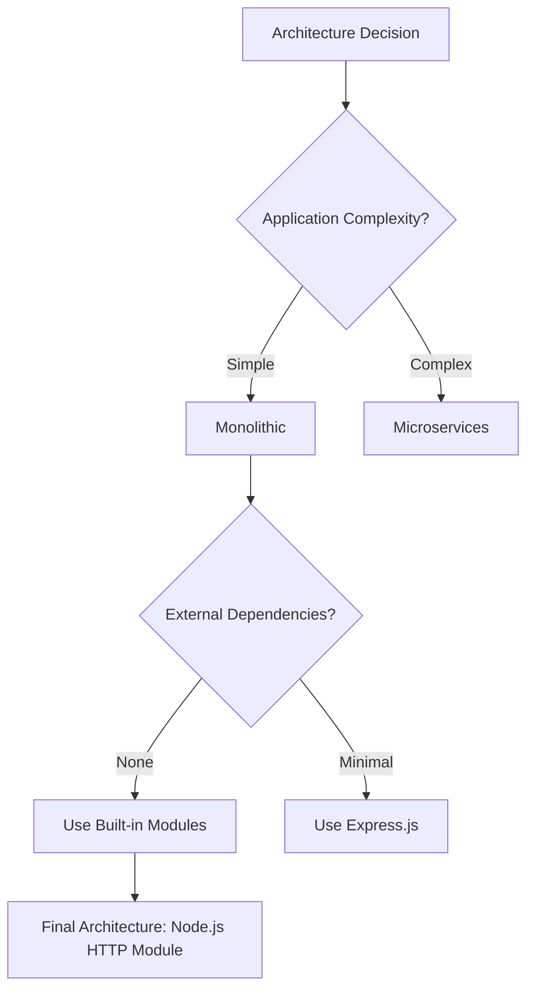
```mermaid
flowchart TD
    A[Architecture Decision] --> B{Application Complexity?}
    B -->|Simple| C[Monolithic]
    B -->|Complex| D[Microservices]
    C --> E{External Dependencies?}
    E -->|None| F[Use Built-in Modules]
    E -->|Minimal| G[Use Express.js]
    F --> H[Final Architecture: Node.js HTTP Module]
```

### 5.4 CROSS-CUTTING CONCERNS

#### 5.4.1 Error Handling Approach

For this simple application, error handling focuses on:

- Returning appropriate HTTP status codes (404 for invalid routes)
- Providing clear error messages in plain text format
- Graceful handling of server startup errors (e.g., port already in use)

The error handling strategy is deliberately minimal to match the application's educational purpose.

#### 5.4.2 Error Handling Flow

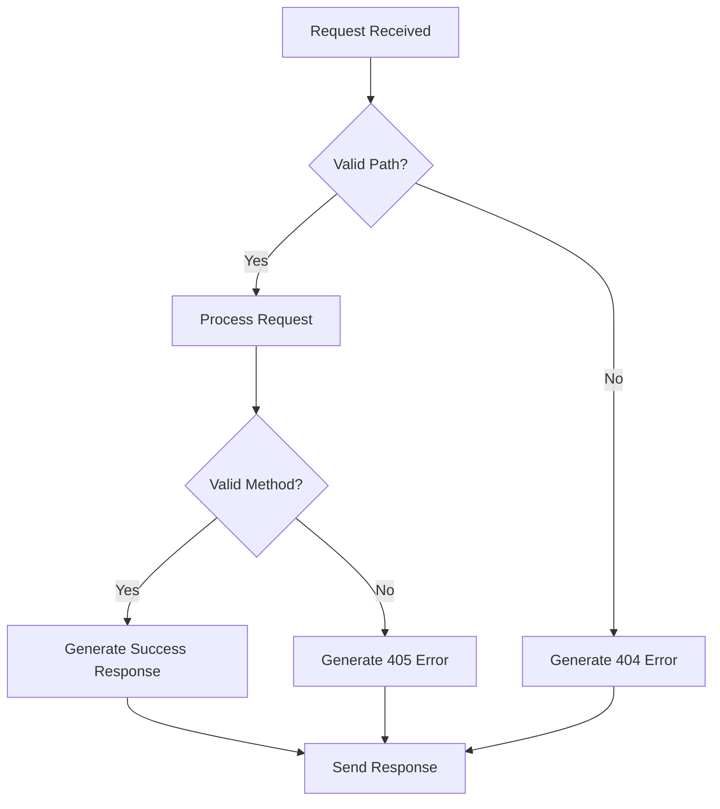
```mermaid
flowchart TD
    A[Request Received] --> B{Valid Path?}
    B -->|Yes| C[Process Request]
    B -->|No| D[Generate 404 Error]
    C --> E{Valid Method?}
    E -->|Yes| F[Generate Success Response]
    E -->|No| G[Generate 405 Error]
    F --> H[Send Response]
    D --> H
    G --> H
```

#### 5.4.3 Logging Strategy

For this simple application, logging is limited to:

- Server startup information (port, start time)
- Basic request logging (path, method, status code)
- Error conditions (invalid routes, server errors)

Console logging is sufficient for the educational purpose of this application.

#### 5.4.4 Performance Considerations

| Aspect | Requirement | Implementation Approach |
|--------|-------------|-------------------------|
| Response Time | < 50ms for all endpoints | Minimal processing logic ensures fast responses |
| Throughput | Educational use only | Single-process design adequate for demonstration |
| Resource Usage | Minimal | No unnecessary memory usage or CPU-intensive operations |

The application's simplicity naturally leads to good performance characteristics without requiring specific optimizations.

## 6. SYSTEM COMPONENTS DESIGN

### 6.1 COMPONENT SPECIFICATIONS

#### 6.1.1 HTTP Server Component

| Attribute | Specification |
|-----------|---------------|
| Component Name | HTTP Server |
| Component Type | Core Infrastructure |
| Primary Responsibility | Create and manage HTTP server instance |
| Implementation Technology | Node.js built-in http module |

**Detailed Description:**
The HTTP Server component is responsible for creating an HTTP server instance, binding to the specified network port, and handling the lifecycle of HTTP requests and responses. It serves as the entry point for all client interactions with the application.

**Key Functions:**
- Initialize HTTP server instance
- Bind to configured network port (default: 3000)
- Accept incoming HTTP connections
- Forward requests to the Request Router
- Send responses back to clients
- Log server startup information

**Interfaces:**
- **Input**: HTTP requests from clients
- **Output**: HTTP responses to clients
- **Dependencies**: Node.js http module

**Configuration Parameters:**

| Parameter | Description | Default Value | Valid Range |
|-----------|-------------|---------------|------------|
| PORT | Network port to listen on | 3000 | 1024-65535 |
| HOST | Network interface to bind to | '0.0.0.0' (all interfaces) | Valid IP address |

#### 6.1.2 Request Router Component

| Attribute | Specification |
|-----------|---------------|
| Component Name | Request Router |
| Component Type | Request Processing |
| Primary Responsibility | Parse and route incoming HTTP requests |
| Implementation Technology | JavaScript functions |

**Detailed Description:**
The Request Router component examines incoming HTTP requests, extracts the URL path and HTTP method, and routes the request to the appropriate handler based on the path. For this application, it routes `/hello` requests to the Hello Endpoint Handler and all other paths to the Error Handler.

**Key Functions:**
- Parse request URL to extract path
- Validate HTTP method
- Route to appropriate handler based on path
- Handle routing errors

**Interfaces:**
- **Input**: HTTP request object from HTTP Server
- **Output**: Routed request to appropriate handler
- **Dependencies**: Hello Endpoint Handler, Error Handler

**Routing Rules:**

| Path | HTTP Method | Handler | Response |
|------|------------|---------|----------|
| /hello | GET | Hello Endpoint Handler | "Hello world" text |
| /hello | Other methods | Error Handler | 405 Method Not Allowed |
| Any other path | Any method | Error Handler | 404 Not Found |

#### 6.1.3 Hello Endpoint Handler Component

| Attribute | Specification |
|-----------|---------------|
| Component Name | Hello Endpoint Handler |
| Component Type | Request Handler |
| Primary Responsibility | Process requests to the `/hello` endpoint |
| Implementation Technology | JavaScript function |

**Detailed Description:**
The Hello Endpoint Handler processes requests to the `/hello` path, generating a simple "Hello world" text response with appropriate HTTP headers and status code.

**Key Functions:**
- Validate the request is for the `/hello` path
- Generate "Hello world" text response
- Set appropriate HTTP headers
- Return response with 200 status code

**Interfaces:**
- **Input**: HTTP request object from Request Router
- **Output**: HTTP response with "Hello world" text
- **Dependencies**: None

**Response Specification:**

| Attribute | Value |
|-----------|-------|
| Status Code | 200 OK |
| Content-Type | text/plain |
| Response Body | "Hello world" |

#### 6.1.4 Error Handler Component

| Attribute | Specification |
|-----------|---------------|
| Component Name | Error Handler |
| Component Type | Error Processing |
| Primary Responsibility | Generate appropriate error responses |
| Implementation Technology | JavaScript function |

**Detailed Description:**
The Error Handler generates appropriate error responses for invalid routes or HTTP methods, setting the correct status code and providing a meaningful error message.

**Key Functions:**
- Determine appropriate error type
- Set correct HTTP status code
- Generate error message
- Return formatted error response

**Interfaces:**
- **Input**: HTTP request object and error information
- **Output**: HTTP error response
- **Dependencies**: None

**Error Response Types:**

| Error Condition | Status Code | Response Body |
|-----------------|-------------|--------------|
| Invalid route | 404 Not Found | "Not Found" |
| Invalid method | 405 Method Not Allowed | "Method Not Allowed" |
| Server error | 500 Internal Server Error | "Internal Server Error" |

### 6.2 COMPONENT INTERACTIONS

#### 6.2.1 Component Interaction Diagram

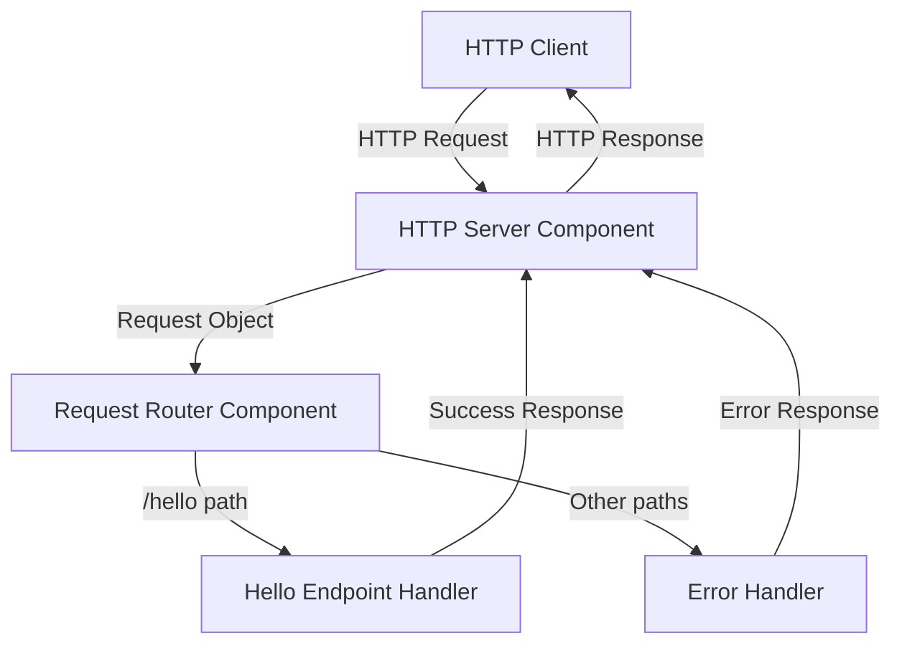
```mermaid
flowchart TD
    Client[HTTP Client] -->|HTTP Request| Server[HTTP Server Component]
    Server -->|Request Object| Router[Request Router Component]
    Router -->|/hello path| HelloHandler[Hello Endpoint Handler]
    Router -->|Other paths| ErrorHandler[Error Handler]
    HelloHandler -->|Success Response| Server
    ErrorHandler -->|Error Response| Server
    Server -->|HTTP Response| Client
```

#### 6.2.2 Request Processing Sequence

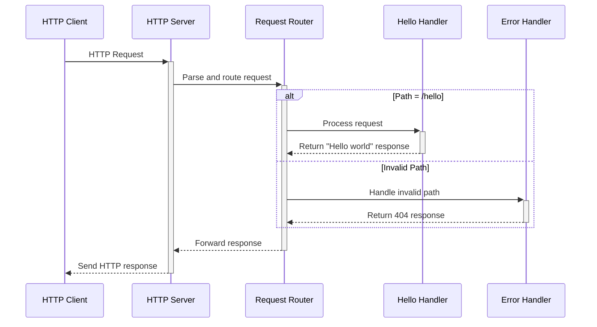
```mermaid
sequenceDiagram
    participant Client as HTTP Client
    participant Server as HTTP Server
    participant Router as Request Router
    participant HelloHandler as Hello Handler
    participant ErrorHandler as Error Handler
    
    Client->>+Server: HTTP Request
    Server->>+Router: Parse and route request
    
    alt Path = /hello
        Router->>+HelloHandler: Process request
        HelloHandler-->>-Router: Return "Hello world" response
    else Invalid Path
        Router->>+ErrorHandler: Handle invalid path
        ErrorHandler-->>-Router: Return 404 response
    end
    
    Router-->>-Server: Forward response
    Server-->>-Client: Send HTTP response
```

#### 6.2.3 Component Communication Contracts

| Source Component | Target Component | Interface Type | Data Exchanged | Error Handling |
|------------------|------------------|----------------|----------------|----------------|
| HTTP Server | Request Router | Function call | HTTP request object | Forward to Error Handler |
| Request Router | Hello Handler | Function call | HTTP request object | Return to HTTP Server |
| Request Router | Error Handler | Function call | HTTP request object, error info | Return to HTTP Server |
| Hello Handler | HTTP Server | Function return | HTTP response object | N/A |
| Error Handler | HTTP Server | Function return | HTTP error response object | N/A |

### 6.3 COMPONENT DESIGN DETAILS

#### 6.3.1 HTTP Server Component Design

**Internal Structure:**

```mermaid
classDiagram
    class HTTPServer {
        -port: number
        -host: string
        -server: http.Server
        +initialize()
        +start()
        +handleRequest(req, res)
        +logServerStart()
    }
    
    class http.Server {
        +listen(port, host, callback)
        +on(event, callback)
    }
    
    HTTPServer --> http.Server : uses
```

**State Management:**
The HTTP Server maintains minimal state:
- Server configuration (port, host)
- Server instance reference

**Error Handling:**
- Port binding errors (e.g., port already in use)
- Connection errors
- Unexpected server exceptions

#### 6.3.2 Request Router Component Design

**Internal Structure:**

```mermaid
classDiagram
    class RequestRouter {
        +route(req, res)
        -parseUrl(req)
        -validateMethod(req, path)
        -routeToHandler(req, res, path)
    }
    
    class HelloHandler {
        +handle(req, res)
    }
    
    class ErrorHandler {
        +handle(req, res, statusCode, message)
    }
    
    RequestRouter --> HelloHandler : routes to
    RequestRouter --> ErrorHandler : routes to
```

**Routing Logic:**
1. Extract path from request URL
2. Check if path matches `/hello`
3. If match, validate HTTP method is GET
4. Route to appropriate handler based on path and method

**Error Handling:**
- Invalid URL format
- Unsupported HTTP methods
- Routing to non-existent handlers

#### 6.3.3 Hello Endpoint Handler Component Design

**Internal Structure:**

```mermaid
classDiagram
    class HelloHandler {
        +handle(req, res)
        -generateResponse(res)
        -setHeaders(res)
    }
```

**Response Generation:**
1. Set Content-Type header to text/plain
2. Set HTTP status code to 200 OK
3. Write "Hello world" to response body
4. End the response

**Error Handling:**
- Response writing errors
- Invalid request objects

#### 6.3.4 Error Handler Component Design

**Internal Structure:**

```mermaid
classDiagram
    class ErrorHandler {
        +handle(req, res, statusCode, message)
        -generateErrorResponse(res, statusCode, message)
        -setErrorHeaders(res)
        -logError(statusCode, message)
    }
```

**Error Types:**
- 404 Not Found: Invalid routes
- 405 Method Not Allowed: Invalid HTTP methods
- 500 Internal Server Error: Unexpected server errors

**Response Generation:**
1. Set Content-Type header to text/plain
2. Set HTTP status code to appropriate error code
3. Write error message to response body
4. End the response

### 6.4 COMPONENT CONFIGURATION

#### 6.4.1 Configuration Parameters

| Component | Parameter | Description | Default Value | Configuration Method |
|-----------|-----------|-------------|---------------|----------------------|
| HTTP Server | PORT | Network port to listen on | 3000 | Environment variable |
| HTTP Server | HOST | Network interface to bind to | '0.0.0.0' | Environment variable |
| HTTP Server | LOG_LEVEL | Detail level for logging | 'info' | Environment variable |

#### 6.4.2 Configuration Loading Process

1. Read environment variables at startup
2. Apply default values for any missing configuration
3. Validate configuration values
4. Initialize components with configuration

#### 6.4.3 Configuration Validation Rules

| Parameter | Validation Rule | Error Handling |
|-----------|-----------------|----------------|
| PORT | Must be a number between 1024-65535 | Log error and use default (3000) |
| HOST | Must be a valid IP address or hostname | Log error and use default ('0.0.0.0') |
| LOG_LEVEL | Must be one of: 'error', 'warn', 'info', 'debug' | Log error and use default ('info') |

### 6.5 COMPONENT TESTING STRATEGY

#### 6.5.1 Component Test Approach

| Component | Test Approach | Test Tools | Key Test Cases |
|-----------|---------------|------------|----------------|
| HTTP Server | Unit tests for initialization and request handling | Node.js assert, mocha | Server initialization, request forwarding |
| Request Router | Unit tests for routing logic | Node.js assert, mocha | Path matching, method validation, handler selection |
| Hello Handler | Unit tests for response generation | Node.js assert, mocha | Response format, headers, content |
| Error Handler | Unit tests for error response generation | Node.js assert, mocha | Different error types, response format |
| Integration | End-to-end HTTP requests | supertest | Complete request-response cycle |

#### 6.5.2 Test Cases for Hello Endpoint

| Test Case ID | Description | Expected Result |
|--------------|-------------|-----------------|
| TC-HELLO-001 | GET request to /hello | 200 OK with "Hello world" response |
| TC-HELLO-002 | POST request to /hello | 405 Method Not Allowed |
| TC-HELLO-003 | GET request to /hello with query parameters | 200 OK with "Hello world" response (parameters ignored) |
| TC-HELLO-004 | GET request to /hello/ (trailing slash) | 200 OK with "Hello world" response |
| TC-HELLO-005 | GET request to /HELLO (case sensitivity) | 404 Not Found |

#### 6.5.3 Test Cases for Error Handling

| Test Case ID | Description | Expected Result |
|--------------|-------------|-----------------|
| TC-ERROR-001 | GET request to non-existent path | 404 Not Found |
| TC-ERROR-002 | POST request to /hello | 405 Method Not Allowed |
| TC-ERROR-003 | Request with malformed URL | 400 Bad Request |
| TC-ERROR-004 | Server error simulation | 500 Internal Server Error |

### 6.1 CORE SERVICES ARCHITECTURE

Core Services Architecture is not applicable for this system in its traditional sense. This application is intentionally designed as a simple, monolithic Node.js HTTP server with a single endpoint. The system does not require microservices, distributed architecture, or distinct service components for the following reasons:

1. **Minimal Functionality**: The application only needs to serve a single `/hello` endpoint with static content.
2. **No Complex Business Logic**: There are no complex business processes requiring separation of concerns.
3. **No Data Persistence**: The application doesn't require databases or state management.
4. **Educational Purpose**: The primary goal is to demonstrate basic HTTP server functionality in Node.js.

However, we can still describe the simplified architecture and address how the system could evolve if requirements changed.

#### 6.1.1 SIMPLIFIED SERVICE ARCHITECTURE

| Component | Responsibility | Implementation |
|-----------|----------------|----------------|
| HTTP Server | Accept and process HTTP requests | Node.js built-in http module |
| Request Router | Direct requests to appropriate handlers | Simple path-based routing logic |
| Hello Endpoint | Process `/hello` requests | Function returning "Hello world" |
| Error Handler | Handle invalid routes and errors | Function returning appropriate error responses |

```mermaid
flowchart TD
    Client[HTTP Client] <--> Server[Node.js HTTP Server]
    Server --> Router[Request Router]
    Router --> HelloHandler[Hello Endpoint Handler]
    Router --> ErrorHandler[Error Handler]
    
    subgraph "Single Node.js Process"
        Server
        Router
        HelloHandler
        ErrorHandler
    end
```

#### 6.1.2 SCALABILITY CONSIDERATIONS

While the current implementation doesn't require complex scalability patterns, here are considerations for potential growth:

| Scalability Aspect | Current Approach | Future Evolution |
|-------------------|------------------|------------------|
| Process Model | Single Node.js process | Node.js cluster module for multi-core utilization |
| Deployment | Single instance | Multiple instances behind load balancer |
| Performance | Minimal processing, fast response | Caching headers, response compression |

```mermaid
flowchart TD
    Client[HTTP Clients] <--> LB[Load Balancer]
    LB --> Server1[Node.js Instance 1]
    LB --> Server2[Node.js Instance 2]
    LB --> ServerN[Node.js Instance N]
    
    subgraph "Potential Future Architecture"
        LB
        Server1
        Server2
        ServerN
    end
```

#### 6.1.3 RESILIENCE CONSIDERATIONS

The current simple implementation has minimal resilience requirements, but here are considerations for increased reliability:

| Resilience Aspect | Current Approach | Future Enhancement |
|-------------------|------------------|-------------------|
| Process Monitoring | Manual restart | Process manager (PM2, Forever) |
| Error Handling | Basic HTTP error codes | Structured error logging and monitoring |
| Health Checks | None | Simple health endpoint for monitoring |

```mermaid
flowchart TD
    Client[HTTP Clients] <--> LB[Load Balancer]
    LB --> Server1[Node.js Instance 1]
    LB --> Server2[Node.js Instance 2]
    
    Monitor[Process Monitor] --> Server1
    Monitor --> Server2
    
    HealthCheck[Health Check System] -.-> Server1
    HealthCheck -.-> Server2
    
    subgraph "Potential Resilience Pattern"
        LB
        Server1
        Server2
        Monitor
        HealthCheck
    end
```

#### 6.1.4 IMPLEMENTATION NOTES

For the current simple requirements, the implementation should focus on:

1. **Clean Code Structure**: Separate concerns between server initialization, request routing, and response handling
2. **Error Handling**: Proper handling of invalid routes and unexpected errors
3. **Configuration**: Environment-based configuration for port and host settings
4. **Logging**: Basic request logging for debugging purposes

This approach provides a solid foundation that can be extended if requirements evolve toward a more complex system requiring true microservices architecture.

### 6.2 DATABASE DESIGN

Database design is not applicable to this system for the following reasons:

1. **No Data Persistence Requirements**: The Node.js HTTP server application with a single `/hello` endpoint that returns "Hello world" does not require any data storage or retrieval functionality. The response is static and does not depend on stored data.

2. **Stateless Operation**: The application operates in a completely stateless manner, with each request being processed independently without needing to maintain state between requests.

3. **No User Data Collection**: The application does not collect, process, or store any user data that would require database storage.

4. **Minimal System Requirements**: The core functionality (returning "Hello world" from a single endpoint) can be fully implemented using in-memory processing without any persistence layer.

5. **Simplicity Focus**: As specified in the project overview, this application is intended to be a minimal, functional example with the lowest possible complexity, which aligns with avoiding unnecessary database components.

#### Alternative Approaches for Future Extensions

If the application were to be extended in the future to require data persistence, the following approaches could be considered:

1. **File-based Storage**: For simple data needs, a JSON file could be used to store configuration or basic data.

2. **Lightweight Databases**: SQLite or LowDB could be integrated for simple structured data storage without requiring a separate database server.

3. **NoSQL Solutions**: MongoDB or Firebase could be added for document-based storage if the application evolved to need flexible schema storage.

4. **Relational Databases**: MySQL or PostgreSQL could be implemented if the application required complex relationships and structured data.

Any of these solutions would require additional design considerations including connection management, error handling, and appropriate data models, which would be documented in this section if they became relevant to the system requirements.

### 6.3 INTEGRATION ARCHITECTURE

Integration Architecture is not applicable for this system in its traditional sense. This application is intentionally designed as a simple, standalone Node.js HTTP server with a single endpoint that returns "Hello world" to clients. The system does not require integration with external systems or services for the following reasons:

1. **Minimal Functionality**: The application only serves a single `/hello` endpoint with static content.
2. **No External Dependencies**: The system operates independently without requiring data or services from external systems.
3. **No Authentication Requirements**: The endpoint is designed to be publicly accessible without authentication.
4. **Educational Purpose**: The primary goal is to demonstrate basic HTTP server functionality in Node.js.

However, we can document the minimal API design that this system implements, which could serve as a foundation if the system were to be expanded in the future.

#### 6.3.1 MINIMAL API DESIGN

| Aspect | Specification |
|--------|---------------|
| Protocol | HTTP/1.1 |
| Endpoint | `/hello` |
| Method | GET |
| Response Format | Plain text |
| Status Codes | 200 OK (success), 404 Not Found (invalid path) |

**API Response Details:**

| Status | Content-Type | Response Body | Use Case |
|--------|--------------|---------------|----------|
| 200 | text/plain | "Hello world" | Successful request to `/hello` |
| 404 | text/plain | "Not Found" | Request to non-existent path |
| 405 | text/plain | "Method Not Allowed" | Non-GET request to `/hello` |

#### 6.3.2 SIMPLIFIED REQUEST FLOW

```mermaid
sequenceDiagram
    participant Client as HTTP Client
    participant Server as Node.js Server
    
    Client->>Server: GET /hello
    Server->>Server: Process request
    Server->>Client: 200 OK "Hello world"
    
    Client->>Server: GET /invalid
    Server->>Server: Process request
    Server->>Client: 404 Not Found
    
    Client->>Server: POST /hello
    Server->>Server: Process request
    Server->>Client: 405 Method Not Allowed
```

#### 6.3.3 POTENTIAL FUTURE INTEGRATION CONSIDERATIONS

If this system were to be expanded in the future, the following integration aspects would need to be addressed:

```mermaid
flowchart TD
    Client[HTTP Client] --> Server[Node.js Server]
    Server --> HelloEndpoint[/hello Endpoint]
    
    subgraph FutureIntegrationPoints["Future Integration Points"]
        Server -.-> Auth[Authentication Service]
        Server -.-> Logging[Logging Service]
        Server -.-> Metrics[Metrics Collection]
        HelloEndpoint -.-> DataService[Data Service]
    end
    
    style FutureIntegrationPoints fill:#f5f5f5,stroke-dasharray: 5 5
```

**Potential Future API Enhancements:**

| Enhancement Area | Approach |
|------------------|----------|
| Authentication | JWT-based authentication for protected endpoints |
| Rate Limiting | Token bucket algorithm with configurable limits |
| Versioning | URL path versioning (e.g., `/v1/hello`) |
| Documentation | OpenAPI/Swagger specification |

**Potential External System Integration:**

| System Type | Integration Pattern |
|-------------|---------------------|
| Logging Service | Asynchronous log shipping |
| Monitoring System | Metrics exposure via dedicated endpoint |
| Data Services | RESTful API calls or message queue |

These considerations are documented for completeness but are not required for the current implementation of this simple Node.js HTTP server.

### 6.4 SECURITY ARCHITECTURE

Detailed Security Architecture is not applicable for this system due to its minimal scope and educational purpose. The Node.js HTTP server with a single `/hello` endpoint that returns "Hello world" is designed as a simple demonstration application with no authentication requirements, no sensitive data handling, and no access control needs.

#### 6.4.1 STANDARD SECURITY PRACTICES

While a comprehensive security architecture is not required, the following standard security practices will be implemented:

| Security Practice | Implementation Approach | Purpose |
|-------------------|-------------------------|---------|
| Input Validation | Validate request paths and methods | Prevent path traversal and invalid method attacks |
| Error Handling | Return appropriate status codes without system details | Avoid information disclosure |
| HTTP Headers | Set basic security headers | Improve browser security posture |
| Dependency Management | Use current Node.js version | Ensure security patches are applied |

#### 6.4.2 SECURITY CONSIDERATIONS

```mermaid
flowchart TD
    Client[HTTP Client] --> Server[Node.js Server]
    
    subgraph "Security Boundary"
        Server --> Router[Request Router]
        Router --> HelloEndpoint[/hello Endpoint]        
        Router --> ErrorHandler[Error Handler]
        
        SecurityHeaders[Security Headers] --> Server
    end
    
    style SecurityHeaders fill:#f9f,stroke:#333,stroke-width:1px
    style "Security Boundary" fill:#f5f5f5,stroke:#666,stroke-width:2px
```

#### 6.4.3 SECURITY HEADERS

The following security headers will be implemented as a basic security measure:

| Header | Value | Purpose |
|--------|-------|---------|
| X-Content-Type-Options | nosniff | Prevent MIME type sniffing |
| X-Frame-Options | DENY | Prevent clickjacking attacks |
| Content-Security-Policy | default-src 'none' | Restrict resource loading |
| Cache-Control | no-store | Prevent response caching |

#### 6.4.4 SECURITY IMPLEMENTATION NOTES

For this simple application, security is implemented through:

1. **Path Validation**: Ensuring only the `/hello` path is processed
2. **Method Validation**: Ensuring only GET requests are accepted for the `/hello` endpoint
3. **Error Handling**: Returning appropriate error codes without exposing system details
4. **Security Headers**: Setting basic security headers on all responses

#### 6.4.5 FUTURE SECURITY CONSIDERATIONS

If this application were to be expanded beyond its educational purpose, the following security enhancements would be recommended:

```mermaid
flowchart TD
    Client[HTTP Client] --> WAF[Web Application Firewall]
    WAF --> LB[Load Balancer]
    LB --> Server[Node.js Server]
    
    subgraph EnhancedSecurityArchitecture["Enhanced Security Architecture"]
        Server --> Auth[Authentication]
        Server --> RBAC[Authorization]
        Server --> Logging[Security Logging]
        
        Auth --> TokenService[Token Service]
        RBAC --> PolicyService[Policy Service]
        Logging --> LogAggregator[Log Aggregator]
    end
    
    style EnhancedSecurityArchitecture fill:#f5f5f5,stroke:#666,stroke-width:2px,stroke-dasharray: 5 5
```

| Security Enhancement | Implementation Approach | Applicability |
|----------------------|-------------------------|---------------|
| Rate Limiting | Token bucket algorithm | Prevent DoS attacks |
| HTTPS | TLS 1.3 with modern ciphers | Secure communication |
| Dependency Scanning | Automated vulnerability scanning | Prevent supply chain attacks |
| Container Security | Minimal base images, non-root user | Reduce attack surface |

These enhancements would only be necessary if the application scope expanded to include sensitive data, authentication requirements, or production deployment needs beyond its current educational purpose.

### 6.5 MONITORING AND OBSERVABILITY

Detailed Monitoring Architecture is not applicable for this system due to its minimal scope and educational purpose. The Node.js HTTP server with a single `/hello` endpoint that returns "Hello world" is designed as a simple demonstration application that doesn't require comprehensive monitoring infrastructure or complex observability patterns.

#### 6.5.1 BASIC MONITORING PRACTICES

While a comprehensive monitoring architecture is not required, the following basic monitoring practices will be implemented:

| Monitoring Practice | Implementation Approach | Purpose |
|---------------------|-------------------------|---------|
| Console Logging | Log server startup and requests | Provide basic visibility into application operation |
| Process Monitoring | Optional use of process manager (PM2) | Ensure server restarts after crashes |
| Basic Health Check | `/hello` endpoint serves as health check | Verify application is operational |

#### 6.5.2 SIMPLIFIED HEALTH MONITORING

```mermaid
flowchart TD
    Client[HTTP Client] --> Server[Node.js Server]
    Monitor[Basic Monitoring] --> Server
    
    subgraph MonitoringComponents["Monitoring Components"]
        Monitor --> ConsoleLogging[Console Logging]
        Monitor --> ProcessCheck[Process Check]
        Monitor --> EndpointCheck[Endpoint Check]
    end
    
    style MonitoringComponents fill:#f5f5f5,stroke:#666,stroke-width:2px
```

#### 6.5.3 BASIC LOGGING IMPLEMENTATION

The application will implement minimal logging focused on operational visibility:

| Log Event | Information Captured | Log Level |
|-----------|----------------------|-----------|
| Server Start | Port, timestamp, Node.js version | INFO |
| Request Received | Method, path, timestamp | INFO |
| Request Completed | Status code, response time | INFO |
| Error Occurred | Error message, stack trace | ERROR |

#### 6.5.4 SIMPLE HEALTH CHECK

The `/hello` endpoint itself serves as a basic health check with the following characteristics:

| Aspect | Details |
|--------|---------|
| Endpoint | GET /hello |
| Expected Response | "Hello world" with 200 status |
| Check Frequency | As needed (manual or simple monitoring) |
| Failure Action | Manual restart or automatic via process manager |

#### 6.5.5 FUTURE MONITORING CONSIDERATIONS

If this application were to be expanded beyond its educational purpose, the following monitoring enhancements would be recommended:

```mermaid
flowchart TD
    Client[HTTP Client] --> Server[Node.js Server]
    
    subgraph EnhancedMonitoring["Enhanced Monitoring"]
        Prometheus[Prometheus] --> Server
        Server --> LogCollector[Log Collector]
        HealthCheck[Health Check Service] --> Server
        
        Prometheus --> Grafana[Grafana Dashboards]
        LogCollector --> ElasticSearch[ElasticSearch]
        ElasticSearch --> Kibana[Kibana]
        
        Grafana --> AlertManager[Alert Manager]
        Kibana --> AlertManager
        AlertManager --> Notification[Notification Service]
    end
    
    style EnhancedMonitoring fill:#f5f5f5,stroke:#666,stroke-width:2px,stroke-dasharray: 5 5
```

| Monitoring Enhancement | Implementation Approach | Applicability |
|------------------------|-------------------------|---------------|
| Metrics Collection | Prometheus client for Node.js | Track request rates, response times |
| Log Aggregation | Winston/Bunyan with ELK stack | Centralized log analysis |
| Distributed Tracing | OpenTelemetry instrumentation | Track request flow through system |
| Alerting | Prometheus AlertManager | Notify on service degradation |
| Dashboards | Grafana with custom panels | Visualize system health |

These enhancements would only be necessary if the application scope expanded to include production deployment needs beyond its current educational purpose.

#### 6.5.6 BASIC METRICS FOR CONSIDERATION

If basic metrics were to be collected, the following would be most relevant:

| Metric | Description | Collection Method | Importance |
|--------|-------------|-------------------|------------|
| Request Count | Total number of requests | Request counter | High |
| Response Time | Time to process requests | Request timer | High |
| Error Rate | Percentage of failed requests | Status code counter | High |
| CPU Usage | Server CPU utilization | OS metrics | Medium |

#### 6.5.7 SIMPLIFIED INCIDENT RESPONSE

For this educational application, incident response is minimal and manual:

1. **Detection**: Manual verification that the endpoint is responding
2. **Resolution**: Manual restart of the Node.js process
3. **Prevention**: Code review to identify and fix issues

For production applications, a more comprehensive incident response plan would be required, including automated detection, alerting, and resolution procedures.

### 6.6 TESTING STRATEGY

#### 6.6.1 TESTING APPROACH

While comprehensive testing infrastructure is not required for this simple Node.js HTTP server application, a basic testing strategy will ensure the application functions correctly and reliably. The testing approach will focus primarily on unit testing with minimal integration testing to verify the endpoint behavior.

##### Unit Testing

| Aspect | Specification |
|--------|---------------|
| Testing Framework | Jest or Mocha with Chai |
| Test Organization | Tests organized by component (server, router, handlers) |
| Mocking Strategy | HTTP request/response objects mocked for handler tests |
| Code Coverage | Minimum 80% code coverage for core functionality |

**Test Structure Example:**

```mermaid
flowchart TD
    TestSuite[Test Suite] --> ServerTests[HTTP Server Tests]
    TestSuite --> RouterTests[Request Router Tests]
    TestSuite --> HandlerTests[Endpoint Handler Tests]
    TestSuite --> ErrorTests[Error Handler Tests]
    
    ServerTests --> ST1[Test server initialization]
    ServerTests --> ST2[Test port binding]
    
    RouterTests --> RT1[Test path routing]
    RouterTests --> RT2[Test method validation]
    
    HandlerTests --> HT1[Test hello response content]
    HandlerTests --> HT2[Test hello response headers]
    
    ErrorTests --> ET1[Test 404 for invalid paths]
    ErrorTests --> ET2[Test 405 for invalid methods]
```

**Test Naming Conventions:**

| Pattern | Example | Purpose |
|---------|---------|---------|
| `describe('Component')` | `describe('Hello Handler')` | Group related tests |
| `it('should behavior')` | `it('should return Hello world')` | Describe expected behavior |
| `test('feature does action')` | `test('server listens on port')` | Alternative test declaration |

##### Integration Testing

| Aspect | Specification |
|--------|---------------|
| Testing Approach | HTTP requests to running server |
| Testing Tool | Supertest or Axios with test framework |
| Test Scenarios | Basic endpoint functionality and error cases |
| Environment | Local development environment |

#### 6.6.2 TEST CASES

##### Unit Test Cases

| Test ID | Component | Test Description | Expected Result |
|---------|-----------|------------------|----------------|
| UT-001 | HTTP Server | Server initialization | Server object created |
| UT-002 | HTTP Server | Server port binding | Server listens on specified port |
| UT-003 | Request Router | Route /hello path | Request routed to hello handler |
| UT-004 | Request Router | Route invalid path | Request routed to error handler |
| UT-005 | Hello Handler | Process GET request | Returns "Hello world" with 200 status |
| UT-006 | Hello Handler | Process non-GET request | Returns 405 Method Not Allowed |
| UT-007 | Error Handler | Handle 404 error | Returns Not Found with 404 status |
| UT-008 | Error Handler | Handle 405 error | Returns Method Not Allowed with 405 status |

##### Integration Test Cases

| Test ID | Test Description | Test Steps | Expected Result |
|---------|------------------|-----------|----------------|
| IT-001 | GET /hello returns Hello world | Send GET request to /hello | 200 OK with "Hello world" body |
| IT-002 | GET /invalid returns 404 | Send GET request to /invalid | 404 Not Found response |
| IT-003 | POST /hello returns 405 | Send POST request to /hello | 405 Method Not Allowed response |
| IT-004 | Server handles concurrent requests | Send 10 simultaneous requests | All requests processed successfully |

#### 6.6.3 TEST EXECUTION FLOW

```mermaid
flowchart TD
    Start([Start Testing]) --> UnitTests[Run Unit Tests]
    UnitTests --> UnitPass{Pass?}
    
    UnitPass -->|Yes| IntegrationTests[Run Integration Tests]
    UnitPass -->|No| FixIssues[Fix Issues]
    
    IntegrationTests --> IntPass{Pass?}
    IntPass -->|Yes| Coverage[Check Code Coverage]
    IntPass -->|No| FixIssues
    
    FixIssues --> UnitTests
    
    Coverage --> CoverageOK{>= 80%?}
    CoverageOK -->|Yes| End([End Testing])
    CoverageOK -->|No| AddTests[Add More Tests]
    
    AddTests --> UnitTests
```

#### 6.6.4 TEST AUTOMATION

For this simple application, a lightweight test automation approach is sufficient:

| Aspect | Implementation |
|--------|----------------|
| Test Runner | npm test script |
| Coverage Tool | Jest or nyc (Istanbul) |
| CI Integration | Optional GitHub Actions workflow |
| Test Reports | Console output and coverage reports |

**Example Test Script Configuration:**

```mermaid
flowchart LR
    npm[npm test] --> Jest[Jest Runner]
    Jest --> UnitTests[Unit Tests]
    Jest --> IntegrationTests[Integration Tests]
    Jest --> Coverage[Coverage Report]
    
    Coverage --> Report[HTML Report]
```

#### 6.6.5 QUALITY METRICS

| Metric | Target | Measurement Method |
|--------|--------|-------------------|
| Code Coverage | ≥ 80% | Jest/Istanbul coverage report |
| Test Success Rate | 100% | All tests must pass |
| Response Time | < 50ms | Performance assertions in tests |
| Code Quality | No issues | ESLint with recommended rules |

#### 6.6.6 TEST ENVIRONMENT

For this simple application, the test environment is minimal:

```mermaid
flowchart TD
    Developer[Developer Machine] --> NodeJS[Node.js Runtime]
    NodeJS --> TestFramework[Test Framework]
    TestFramework --> UnitTests[Unit Tests]
    TestFramework --> IntegrationTests[Integration Tests]
    
    IntegrationTests --> ServerInstance[Test Server Instance]
    ServerInstance --> InMemoryExecution[In-Memory Execution]
```

#### 6.6.7 EXAMPLE TEST PATTERNS

##### Unit Test Example Pattern

| Component | Test Pattern | Mocking Approach |
|-----------|--------------|------------------|
| Hello Handler | 1. Create mock request/response objects 2. Call handler function 3. Assert response status and body | Mock response with spies for status and send methods |
| Request Router | 1. Create mock request with path 2. Create mock response 3. Call router function 4. Assert correct handler called | Mock handlers and verify they're called with correct arguments |

##### Integration Test Example Pattern

| Scenario | Test Pattern | Validation Approach |
|----------|--------------|---------------------|
| Hello Endpoint | 1. Start server 2. Send HTTP request to /hello 3. Verify response | Assert status code 200 and body contains "Hello world" |
| Error Handling | 1. Start server 2. Send HTTP request to invalid path 3. Verify error response | Assert status code 404 and appropriate error message |

#### 6.6.8 SECURITY TESTING

For this simple application, basic security testing is sufficient:

| Test Type | Test Focus | Implementation |
|-----------|------------|----------------|
| Input Validation | Path parameter validation | Test with various malformed paths |
| Error Handling | Proper error responses | Verify no sensitive information in errors |
| HTTP Headers | Security headers | Verify appropriate headers are set |

#### 6.6.9 RESOURCE REQUIREMENTS

| Resource | Specification | Purpose |
|----------|---------------|---------|
| Development Machine | Standard developer workstation | Running tests locally |
| Node.js | Version 18.x LTS | Test execution environment |
| Memory | 512MB minimum | Test process execution |
| CI Environment | GitHub Actions (optional) | Automated test execution |

#### 6.6.10 TEST DATA MANAGEMENT

For this simple application with no data persistence, test data management is minimal:

| Data Type | Management Approach | Usage |
|-----------|---------------------|-------|
| HTTP Requests | Hardcoded in test files | Input for endpoint tests |
| Expected Responses | Defined in test assertions | Validation criteria |
| Mock Objects | Created in test setup | Simulation of HTTP objects |

## 7. USER INTERFACE DESIGN

No user interface required. This project is a simple Node.js HTTP server application that exposes a single REST endpoint `/hello` which returns "Hello world" to clients. It is designed as a backend service without a graphical user interface.

The application will be interacted with programmatically through HTTP requests to the `/hello` endpoint, which can be done using tools like:
- Web browsers
- Command-line tools (curl, wget)
- API testing tools (Postman, Insomnia)
- HTTP client libraries in various programming languages

The response will be plain text "Hello world" with appropriate HTTP headers.

## 8. INFRASTRUCTURE

### 8.1 DEPLOYMENT ENVIRONMENT

Detailed Infrastructure Architecture is not applicable for this system in its traditional sense. This application is intentionally designed as a simple, standalone Node.js HTTP server with minimal requirements for the following reasons:

1. **Educational Purpose**: The primary goal is to demonstrate basic Node.js HTTP server functionality.
2. **Minimal Complexity**: The application only serves a single `/hello` endpoint with static content.
3. **No External Dependencies**: Beyond the Node.js runtime, no additional infrastructure is required.
4. **Local Development Focus**: The application is primarily intended for local development and learning.

However, we will document the minimal requirements for running and distributing this application.

#### 8.1.1 Minimal Requirements

| Requirement Type | Specification | Notes |
|------------------|---------------|-------|
| Runtime Environment | Node.js 18.x LTS | Any modern Node.js LTS version is sufficient |
| Memory | 128MB minimum | Extremely lightweight memory footprint |
| CPU | Single core | No significant CPU requirements |
| Storage | <10MB | Minimal disk space for application code |
| Network | Single port (default: 3000) | Configurable via environment variable |

#### 8.1.2 Local Development Setup

```mermaid
flowchart TD
    Developer[Developer Workstation] --> NodeJS[Node.js Runtime]
    NodeJS --> Application[Hello World Server]
    Application --> Port[Port 3000]
    Port --> Client[HTTP Client]
```

### 8.2 SIMPLIFIED DEPLOYMENT OPTIONS

While detailed infrastructure is not required, here are simple deployment options that could be used if needed:

| Deployment Option | Advantages | Considerations | Recommended For |
|-------------------|------------|----------------|-----------------|
| Local Node.js | Simplest setup, no additional tools | Manual process, limited to local machine | Development, learning |
| Node.js Process Manager | Automatic restarts, basic monitoring | Additional dependency | Basic production use |
| Simple PaaS (Heroku, Glitch) | Zero infrastructure management | Potential costs, platform limitations | Demonstrations, sharing |

### 8.3 CI/CD PIPELINE

For this simple application, a lightweight CI/CD approach is sufficient if needed:

#### 8.3.1 Build Pipeline

| Stage | Tool | Purpose | Configuration |
|-------|------|---------|---------------|
| Source Control | Git | Version control | Standard Git workflow |
| Linting | ESLint | Code quality | Basic Node.js rules |
| Testing | Jest/Mocha | Verify functionality | Unit and basic integration tests |
| Build | npm | Package application | Standard npm scripts |

#### 8.3.2 Simple Deployment Workflow

```mermaid
flowchart TD
    Code[Source Code] --> Git[Git Repository]
    Git --> CI[CI Process]
    
    subgraph CI
        Lint[Lint Code] --> Test[Run Tests]
        Test --> Build[Build Package]
    end
    
    Build --> Deploy[Deploy Options]
    
    Deploy --> Local[Local Node.js]
    Deploy --> PM2[Process Manager]
    Deploy --> PaaS[Platform as a Service]
```

### 8.4 DISTRIBUTION OPTIONS

| Distribution Method | Implementation | Use Case |
|---------------------|----------------|----------|
| Git Repository | Public or private Git repository | Source code distribution |
| npm Package | Published to npm registry | Reusable component |
| Docker Image | Simple Dockerfile | Containerized deployment |

#### 8.4.1 Simple Dockerfile Example

For cases where containerization might be desired, a minimal Dockerfile would be:

```mermaid
flowchart TD
    BaseImage[Node.js Alpine Base Image] --> Dependencies[Install Dependencies]
    Dependencies --> CopyCode[Copy Application Code]
    CopyCode --> ExposePort[Expose Port 3000]
    ExposePort --> StartCommand[Set Start Command]
```

### 8.5 MAINTENANCE CONSIDERATIONS

| Aspect | Approach | Frequency |
|--------|----------|-----------|
| Node.js Updates | Update to latest LTS version | Every 6-12 months |
| Dependency Audits | npm audit | Monthly |
| Security Patches | Apply as needed | As released |

### 8.6 MINIMAL MONITORING

For basic operational visibility, the following simple monitoring could be implemented:

| Monitoring Aspect | Implementation | Purpose |
|-------------------|----------------|---------|
| Process Uptime | PM2 or simple health check | Verify server is running |
| Request Logging | Console logging or simple file logs | Track usage patterns |
| Error Tracking | Console error logging | Identify issues |

```mermaid
flowchart TD
    Application[Hello World Server] --> Logs[Console Logs]
    Application --> Health[Health Check: /hello]
    
    Logs --> Developer[Developer Review]
    Health --> Monitor[Basic Monitoring]
```

### 8.7 RESOURCE SIZING GUIDELINES

| Environment | CPU | Memory | Instances | Notes |
|-------------|-----|--------|-----------|-------|
| Development | 1 core | 128MB | 1 | Local development |
| Production (if needed) | 1 core | 256MB | 1-2 | Minimal redundancy |

### 8.8 COST CONSIDERATIONS

For educational and development purposes, this application can be run at effectively zero cost using:

| Resource | Cost Estimate | Notes |
|----------|---------------|-------|
| Local Development | $0 | Using existing developer machine |
| Free Tier PaaS | $0 | Many platforms offer free tiers (Heroku, Glitch, Vercel) |
| Minimal VPS | $3-5/month | If dedicated hosting is required |

### 8.9 DISASTER RECOVERY

For this simple application, disaster recovery is straightforward:

1. **Source Code**: Maintained in version control (Git)
2. **Recovery Process**: Re-deploy from source
3. **Recovery Time**: Minutes (manual process) or seconds (automated deployment)

### 8.10 CONCLUSION

This Node.js Hello World application is intentionally designed to be minimal and self-contained, requiring only the Node.js runtime environment. It can be run locally for development and learning purposes without additional infrastructure. If deployment is desired, simple options like process managers or PaaS platforms provide the easiest path with minimal overhead.

The application's simplicity makes it an ideal learning tool while avoiding unnecessary infrastructure complexity that would detract from its educational value.

## APPENDICES

### A. ADDITIONAL TECHNICAL INFORMATION

#### A.1 Node.js Version Compatibility

| Node.js Version | Compatibility | Notes |
|-----------------|---------------|-------|
| Node.js 18.x LTS | Fully Compatible | Recommended version |
| Node.js 16.x LTS | Compatible | Minimum recommended version |
| Node.js 20.x LTS | Compatible | Latest LTS version |
| Node.js <16.x | Not Recommended | May work but not officially supported |

#### A.2 HTTP Status Codes Used

| Status Code | Description | Usage in Application |
|-------------|-------------|----------------------|
| 200 OK | Request succeeded | Successful response from `/hello` endpoint |
| 404 Not Found | Resource not found | Response for requests to undefined routes |
| 405 Method Not Allowed | Method not allowed for resource | Non-GET requests to `/hello` endpoint |
| 500 Internal Server Error | Server error | Unexpected application errors |

#### A.3 Environment Variables

| Variable | Purpose | Default Value | Notes |
|----------|---------|---------------|-------|
| PORT | Server listening port | 3000 | Can be any valid port (1024-65535) |
| HOST | Server binding address | '0.0.0.0' | '0.0.0.0' binds to all interfaces |
| NODE_ENV | Runtime environment | 'development' | 'development', 'production', 'test' |

#### A.4 Request-Response Flow Diagram

```mermaid
sequenceDiagram
    participant Client as HTTP Client
    participant Server as Node.js Server
    participant Router as Request Router
    participant Handler as Handler Function
    
    Client->>+Server: HTTP Request
    Server->>+Router: Parse URL and Method
    
    alt Path is /hello and Method is GET
        Router->>+Handler: Process valid request
        Handler-->>-Router: "Hello world" response
        Router-->>Server: 200 OK response
    else Path is /hello but Method is not GET
        Router-->>Server: 405 Method Not Allowed
    else Path is not /hello
        Router-->>Server: 404 Not Found
    end
    
    Server-->>-Client: HTTP Response
```

#### A.5 Performance Characteristics

| Metric | Expected Value | Notes |
|--------|----------------|-------|
| Response Time | <10ms | For `/hello` endpoint under normal load |
| Memory Usage | <50MB | Single Node.js process |
| Concurrent Connections | 100+ | Default Node.js HTTP server capacity |
| Startup Time | <1 second | Time to bind to port and begin accepting connections |

### B. GLOSSARY

| Term | Definition |
|------|------------|
| Endpoint | A specific URL path that can be accessed via HTTP requests |
| Handler | A function that processes HTTP requests and generates responses |
| HTTP Server | Software that listens for and responds to HTTP requests |
| Middleware | Functions that have access to the request and response objects in the application's request-response cycle |
| REST | Representational State Transfer, an architectural style for designing networked applications |
| Route | A definition of how an application responds to client requests to specific endpoints |
| Status Code | A standard code in HTTP responses to indicate the request's result |

### C. ACRONYMS

| Acronym | Expanded Form |
|---------|---------------|
| API | Application Programming Interface |
| CI/CD | Continuous Integration/Continuous Deployment |
| HTTP | Hypertext Transfer Protocol |
| JSON | JavaScript Object Notation |
| LTS | Long-Term Support |
| NPM | Node Package Manager |
| REST | Representational State Transfer |
| URL | Uniform Resource Locator |
| VPS | Virtual Private Server |

### D. SAMPLE CODE SNIPPETS

*Note: These are provided for reference only and are not part of the implementation.*

#### D.1 Basic Server Structure

```mermaid
flowchart TD
    A[server.js] --> B[Create HTTP Server]
    B --> C[Define Request Handler]
    C --> D[Route Requests]
    D --> E1[/hello Handler]
    D --> E2[Error Handler]
    B --> F[Listen on Port]
```

#### D.2 Testing Approach

```mermaid
flowchart LR
    A[Test Suite] --> B1[Server Tests]
    A --> B2[Route Tests]
    A --> B3[Handler Tests]
    
    B1 --> C1[Test Server Creation]
    B1 --> C2[Test Port Binding]
    
    B2 --> D1[Test Valid Routes]
    B2 --> D2[Test Invalid Routes]
    
    B3 --> E1[Test Hello Response]
    B3 --> E2[Test Error Responses]
```

### E. DEVELOPMENT WORKFLOW

```mermaid
flowchart TD
    A[Setup Project] --> B[Implement HTTP Server]
    B --> C[Implement Request Router]
    C --> D[Implement Hello Handler]
    C --> E[Implement Error Handler]
    D --> F[Write Tests]
    E --> F
    F --> G[Manual Testing]
    G --> H{Tests Pass?}
    H -->|No| I[Fix Issues]
    I --> F
    H -->|Yes| J[Documentation]
    J --> K[Project Complete]
```

### F. TROUBLESHOOTING GUIDE

| Issue | Possible Cause | Resolution |
|-------|---------------|------------|
| Server won't start | Port already in use | Change PORT environment variable |
| Server won't start | Permission issues | Use port >1024 or run with elevated privileges |
| 404 errors | Incorrect URL path | Ensure path is exactly `/hello` (case-sensitive) |
| Empty response | Incorrect response handling | Verify response.end() is called with content |
| EADDRINUSE error | Port conflict | Stop other services using the port or change port |